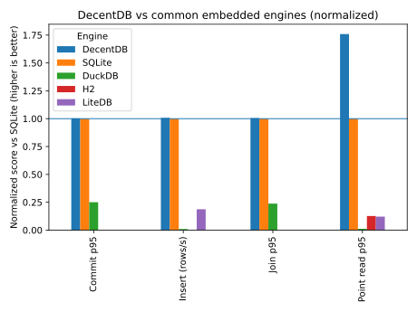

# DecentDB

<p align="center">
    
</p>

<p align="center">
    <a href="https://nim-lang.org">
        
    </a>
    <a href="LICENSE">
        
    </a>
    <a href="#">
        
    </a>
</p>

```text                                       
  ___                 _   ___  ___ 
 |   \ ___ __ ___ _ _| |_|   \| _ )
 | |) / -_) _/ -_) ' \  _| |) | _ \
 |___/\___\__\___|_||_\__|___/|___/
                                                             
```
                                                  
ACID first. Everything else… eventually.

DecentDB is a embedded relational database engine focused on **durable writes**, **fast reads**, and **predictable correctness**. It targets a single process with **one writer** and **many concurrent readers** under snapshot isolation. DecentDB provides a PostgreSQL-like SQL interface with ACID transactions, efficient B+Tree storage, and concurrent read access. It is not intended to be the best embedded database engine, but not terrible, a decent better than some engine.

## Status

- Current version: **0.0.1** (beta)
- Planned initial stable release: **1.0.0** once the engine is feature-complete, unit tests are more robust, and benchmarks are acceptable.

## Features

- 🔒 **ACID Transactions** - Write-ahead logging with crash-safe recovery
- 🌳 **B+Tree Storage** - Efficient tables and secondary indexes with page caching
- 🐘 **PostgreSQL-like SQL** - Familiar DDL/DML syntax with JOINs, CTEs, Window Functions
- 👥 **Concurrent Reads** - Snapshot isolation allows multiple readers with one writer
- 🔎 **Trigram Index** - Fast text search for `LIKE '%pattern%'` queries
- 🧪 **Comprehensive Testing** - Unit tests, property tests, crash injection, and differential testing
- 🔄 **Foreign Key Constraints** - Automatic indexing and referential integrity enforcement
- 📊 **Rich Query Support** - Aggregates, UPSERT, Set Operations, and Scalar Functions
- ⚡ **Triggers** - AFTER and INSTEAD OF triggers for complex logic
- 📦 **Single File Database** - Portable database stored in a single file
- 🌐 **Cross-Platform** - Runs on Linux, macOS, and Windows
- 🚀 **Bulk Load Operations** - Optimized high-performance data loading
- 🛠️ **Rich CLI Tool** - Unified command-line interface for all database operations
- 📁 **Import/Export Tools** - CSV and JSON data import/export capabilities
- 🧩 **Parameterized Queries** - Safe parameter binding to prevent SQL injection
- 🧾 **Transaction Support** - BEGIN, COMMIT, ROLLBACK for atomic operations

## Languages/Toolkits/SDKs

| Language | Toolkit | Description | Documentation |
|---|---|---|---|
| C# | ADO.NET + Dapper + MicroOrm (LINQ) | Embedded provider + LINQ-style `IQueryable` Micro-ORM for querying DecentDB files | [decentdb.org/api/dotnet](https://decentdb.org/api/dotnet/) |
| Go | `database/sql` + sqlc | Embedded `database/sql` driver optimized for sqlc-generated queries | [decentdb.org/api/go](https://decentdb.org/api/go/) |
| Node.js | N-API + Knex | Embedded native addon + Knex client for building/issuing queries | [decentdb.org/api/node](https://decentdb.org/api/node/) |
| Python 3 | SQLAlchemy | Embedded DB-API driver + SQLAlchemy dialect | [decentdb.org/api/python](https://decentdb.org/api/python/) |

## Tools
**[MehSQL](https://github.com/sphildreth/mehsql)** - Native cross platform DecentDB SQL Query tool.

## Performance (at a glance)

<p align="center">
    
</p>

**How this chart is produced**
- The chart is generated from benchmark runs using `nimble bench_embedded_chart`.
- Values are **normalized vs SQLite** (baseline = 1.0).
- For "lower is better" metrics (latency, DB size), the score is inverted so **higher bars mean better**.
- Full methodology and raw results live in `benchmarks/embedded_compare/`.

**Supported engines**
- DecentDB (native API)
- SQLite (via C API)
- DuckDB (via C API) - when library is available

**Regenerate**
```bash
# Run full benchmark pipeline (all engines, aggregate, chart)
nimble bench_embedded_pipeline

# Or run individual steps:
nimble bench_embedded_sample    # Run all engines
nimble bench_embedded_aggregate  # Aggregate results
nimble bench_embedded_chart     # Generate chart

# Run specific engines only:
./build/run_benchmarks /tmp/bench_out --engines=decentdb,sqlite
./build/run_benchmarks /tmp/bench_out --engines=all
```

## Quick Start

### Prerequisites

- [Nim](https://nim-lang.org) (includes `nim` + `nimble`)
- Python 3
- libpg_query (C library + headers)

### Installation

```bash
nimble build
```

### Create a Database

```bash
# Create and query a database
decentdb exec --db ./my.ddb --sql "CREATE TABLE users (id INT PRIMARY KEY, name TEXT, email TEXT)"
decentdb exec --db ./my.ddb --sql "INSERT INTO users VALUES (1, 'Alice', 'alice@example.com')"
decentdb exec --db ./my.ddb --sql "SELECT * FROM users"
```

### REPL Mode

```bash
decentdb repl --db ./my.ddb
```

## Usage Examples

### SQL Operations

```bash
# Create tables with constraints
decentdb exec --db ./my.ddb --sql "CREATE TABLE orders (
    id INT PRIMARY KEY,
    user_id INT REFERENCES users(id),
    amount FLOAT64,
    created_at INT
)"

# Insert data
decentdb exec --db ./my.ddb --sql "INSERT INTO orders VALUES (1, 1, 99.99, 1704067200)"

# Query with JOINs
decentdb exec --db ./my.ddb --sql "SELECT u.name, SUM(o.amount) 
    FROM users u 
    JOIN orders o ON u.id = o.user_id 
    GROUP BY u.name"

# Text search with trigram index
decentdb exec --db ./my.ddb --sql "CREATE INDEX idx_users_name ON users USING trigram(name)"
decentdb exec --db ./my.ddb --sql "SELECT * FROM users WHERE name LIKE '%ali%'"
```

### Import/Export

```bash
# Import CSV data
decentdb import --table users --input data.csv --db ./my.ddb

# Export to JSON
decentdb export --table users --output users.json --db ./my.ddb --format=json

# Bulk load large datasets
decentdb bulk-load --table users --input large_dataset.csv --db ./my.ddb
```

There are several tools for DecentDB that provide importing/converting from other databases, [read more here](https://decentdb.org/development/import-tools/)

### Maintenance

```bash
# Force WAL checkpoint
decentdb checkpoint --db ./my.ddb

# View database statistics
decentdb stats --db ./my.ddb

# Rebuild an index
decentdb rebuild-index --index users_name_idx --db ./my.ddb
```

## CLI Reference

DecentDB provides a unified CLI tool. See `decentdb --help` for all commands.

Common commands:
- `exec` - Execute SQL statements
- `repl` - Interactive SQL shell
- `import` / `export` - Data transfer
- `bulk-load` - High-performance data loading
- `checkpoint` - WAL maintenance
- `list-tables` / `describe` - Schema introspection

## Documentation

- [User Guide](https://decentdb.org/user-guide/sql-reference/) - SQL reference, tutorials, and examples
- [Nim API](https://decentdb.org/api/nim-api/) - Embedded API documentation
- [Architecture](https://decentdb.org/architecture/overview/) - Design and implementation details
- [Contributing](https://decentdb.org/development/contributing/) - Development guidelines

## Architecture

DecentDB is organized into focused modules:

- **VFS** - OS I/O abstraction with fault injection support
- **Pager** - Fixed-size pages, LRU cache, and freelist management
- **WAL** - Append-only log, crash recovery, and checkpointing
- **B+Tree** - Table storage and secondary indexes
- **Record** - Typed value encoding with overflow pages
- **Catalog** - Schema metadata management
- **SQL/Planner/Exec** - Query parsing, planning, and execution
- **Search** - Trigram inverted index for text search

## Development

```bash
# Run tests
nimble test

# Run benchmarks
nimble bench

# Lint code
nimble lint
```

## Coverage

DecentDB can generate a unit test coverage report using `gcov`.

```bash
# Generate coverage (requires gcov)
bash scripts/coverage_nim.sh

# Alternative: run coverage in smaller batches
bash scripts/coverage_batch.sh
```

Outputs:
- build/coverage/summary.txt (human-readable summary)
- build/coverage/summary.json (machine-readable summary)
- build/coverage/gcov/ (raw per-test `.gcov` files)

See [Contributing Guide](https://decentdb.org/development/contributing/) for development workflow and guidelines.

## License

Apache-2.0. See [LICENSE](LICENSE).
