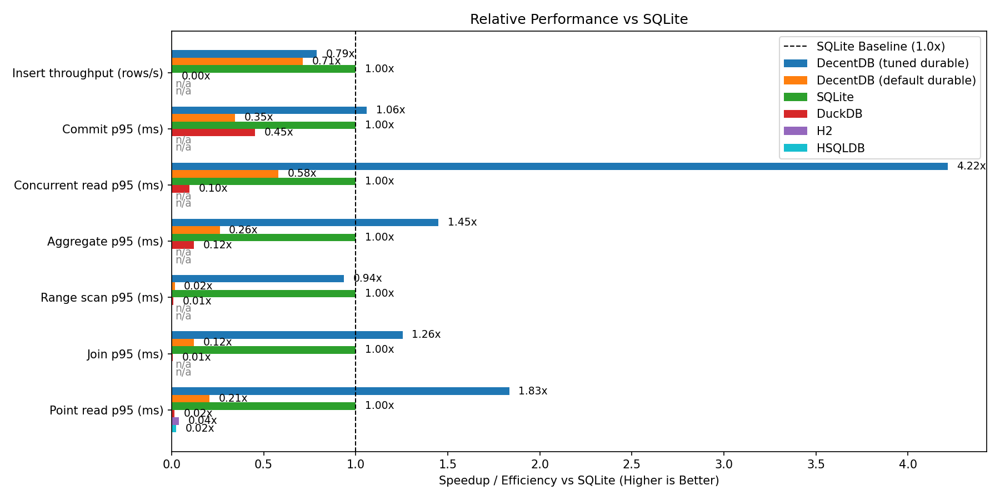
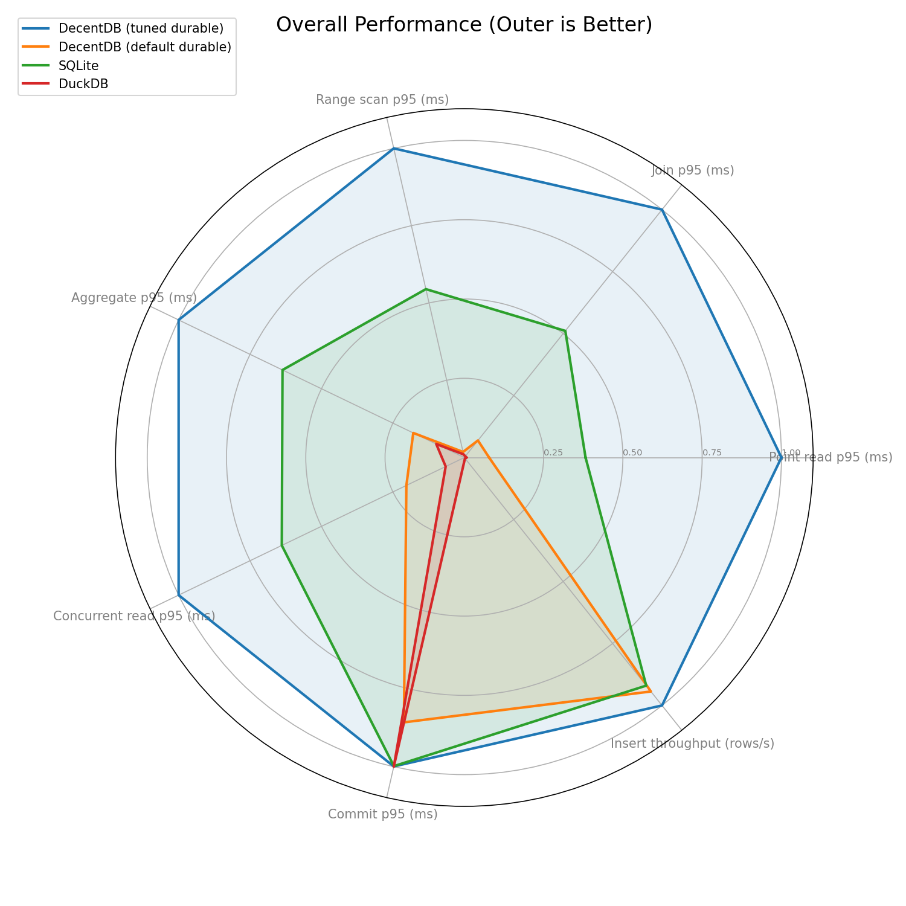

<p align="center">
    
</p>

<p align="center">
    <a href="https://rust-lang.org">
        
    </a>
    <a href="LICENSE">
        
    </a>
    <a href="https://github.com/sphildreth/decentdb/actions/workflows/pr-fast.yml">
        
    </a>
</p>

```text
  ___                 _   ___  ___
 |   \ ___ __ ___ _ _| |_|   \| _ )
 | |) / -_) _/ -_) ' \  _| |) | _ \
 |___/\___\__\___|_||_\__|___/|___/

```

DecentDB is an embedded relational database engine built with Rust, focused on **durable ACID writes**, **fast reads**, and **predictable correctness**.

It targets a single process with **one writer** and **many concurrent readers** under snapshot isolation, implementing a PostgreSQL-like SQL dialect (via libpg_query) on top of a fixed-page B+Tree storage engine and a write-ahead log (WAL) for durability.

## Features

- 🔒 **ACID Transactions** - Write-ahead logging with crash-safe recovery
- 🌳 **B+Tree Storage** - Efficient tables and secondary indexes with page caching
- 🐘 **PostgreSQL-like SQL** - Familiar DDL/DML syntax with JOINs (INNER, LEFT, RIGHT, FULL OUTER, CROSS, NATURAL), CTEs (including WITH RECURSIVE), subqueries, window functions, and rich types (UUID, DECIMAL, native TIMESTAMP)
- 🕒 **Native TIMESTAMP Type** - DATE/TIMESTAMP columns stored as int64 microseconds since Unix epoch (UTC); correct `ORDER BY` and `EXTRACT(YEAR|MONTH|DAY|HOUR|MINUTE|SECOND FROM ...)`, with native bind/read in all bindings
- 👥 **Concurrent Reads** - Snapshot isolation allows multiple readers with one writer
- 🔎 **Trigram Index** - Fast text search for `LIKE '%pattern%'` queries
- 🧪 **Comprehensive Testing** - Unit tests, property tests, crash injection, and differential testing
- 🔄 **Foreign Key Constraints** - Automatic indexing and referential integrity enforcement
- 📊 **Rich Query Support** - Aggregates (including DISTINCT), subqueries (FROM, EXISTS, scalar), UPSERT, set operations, generated columns, and scalar functions (string, math, UUID, JSON)
- ⚡ **Triggers** - AFTER and INSTEAD OF triggers for complex logic
- 💾 **Savepoints** - Nested transaction control with SAVEPOINT, RELEASE, and ROLLBACK TO
- 🧠 **In-Memory Database** - Ephemeral `:memory:` databases for caching and testing, with `save-as` (CLI) / `saveAs` (embedded API) to snapshot to disk
- 📦 **Single-file DB + WAL sidecar** - Primary `.ddb` file with a `-wal` sidecar log for durability
- 🌐 **Cross-Platform** - Native release builds for Linux x86_64/arm64 (including 64-bit Raspberry Pi OS), macOS, and Windows
- 🚀 **Bulk Load Operations** - Optimized high-performance data loading
- 🛠️ **Rich CLI Tool** - Unified command-line interface for all database operations
- 📁 **Import/Export Tools** - CSV and JSON data import/export capabilities
- 🧩 **Parameterized Queries** - Safe parameter binding to prevent SQL injection
- 🧾 **Transaction Support** - BEGIN, COMMIT, ROLLBACK for atomic operations
- 📋 **Temporary Objects** - Session-scoped TEMP tables and views
- 🏗️ **EF Core Provider** - Full Entity Framework Core integration with LINQ translation, migrations, and NodaTime support
- 🔌 **DBeaver Support** - Connect to `.ddb` files from DBeaver via the in-process JNI-backed JDBC driver; browse tables, run queries, and render ER diagrams. See the [DBeaver guide](docs/user-guide/dbeaver.md).

## Languages/Toolkits/SDKs

| Language | Toolkit                                      | Description                                                                                                         | Documentation                                               |
| -------- | -------------------------------------------- | ------------------------------------------------------------------------------------------------------------------- | ----------------------------------------------------------- |
| C#       | ADO.NET + Dapper + MicroOrm (LINQ) + EF Core | Embedded ADO.NET provider, LINQ Micro-ORM, and EF Core integration with DbContext, migrations, and NodaTime support | [decentdb.org/api/dotnet](https://decentdb.org/api/dotnet/) |
| Dart     | Dart FFI (Flutter desktop)                   | Embedded FFI binding for Flutter desktop apps with cursor paging and schema introspection                           | [decentdb.org/api/dart](https://decentdb.org/api/dart/)     |
| Java     | JDBC (JNI-backed, in-process)                | JDBC driver for connecting to `.ddb` files from Java and tools like DBeaver                                         | [decentdb.org/api/jdbc](https://decentdb.org/api/jdbc/)     |
| Go       | `database/sql` driver                        | Embedded `database/sql` driver with `$N` positional parameters                                                      | [decentdb.org/api/go](https://decentdb.org/api/go/)         |
| Node.js  | N-API + Knex                                 | Embedded native addon + Knex client for building/issuing queries                                                    | [decentdb.org/api/node](https://decentdb.org/api/node/)     |
| Python 3 | SQLAlchemy                                   | Embedded DB-API driver + SQLAlchemy dialect                                                                         | [decentdb.org/api/python](https://decentdb.org/api/python/) |

## Tools

**[Decent Bench](https://github.com/sphildreth/decent-bench)** - Native cross platform DecentDB Bench SQL tool.

## Performance (at a glance)

<p align="center">
    
    
</p>

**How this chart is produced**

- The native benchmark summary is generated with `cargo bench -p decentdb --bench embedded_compare`.
- Optional Python-harness engines (for example `H2` and `HSQLDB`) are merged into the README summary with `python scripts/aggregate_benchmarks.py`.
- The README chart assets are rendered from `data/bench_summary.json` by `python scripts/make_readme_chart.py` and `python scripts/visualize_alternative.py`.
- Values are **normalized vs SQLite** (baseline = 1.0).
- For "lower is better" metrics (latency, DB size), the score is inverted so **higher bars mean better**.
- Full methodology lives in `crates/decentdb/benches/embedded_compare.rs`, and the generated summary lives in `data/bench_summary.json`.

**Regenerate**

```bash
# Build the native 3-engine benchmark summary
cargo bench -p decentdb --bench embedded_compare

# After running benchmarks/python_embedded_compare, merge its extra engines
python scripts/aggregate_benchmarks.py \
  --native-summary data/bench_summary.json \
  --python-embedded-compare-results benchmarks/python_embedded_compare/out/results_merged.json \
  --output data/bench_summary.json

# Render the README chart assets from the merged summary
python scripts/make_readme_chart.py
python scripts/visualize_alternative.py
```

## Quick Start

### Prerequisites

- [Rust](https://rustup.rs) (includes `cargo` + `rustc`)
- libpg_query (C library + headers)
- Python 3 (optional; for test harness)

### Download a prebuilt release

GitHub Releases publish native archives for:

- `decentdb-<tag>-Linux-x64.tar.gz`
- `decentdb-<tag>-Linux-arm64.tar.gz` — for 64-bit Raspberry Pi OS on Raspberry Pi 3/4/5 and other aarch64 Linux systems
- `decentdb-<tag>-macOS-x64.tar.gz`
- `decentdb-<tag>-Windows-x64.zip`

Each archive contains the DecentDB CLI plus the native C API library. Extract the archive and add
`decentdb` (or `decentdb.exe`) to your `PATH`.

JDBC and DBeaver assets are published alongside the CLI/native library bundles as
`decentdb-jdbc-<tag>-...` and `decentdb-dbeaver-<tag>-...`, including Linux `arm64` variants for
Raspberry Pi.

### Build from source

```bash
cargo build
# Optionally: install into ~/.cargo/bin
cargo install --path crates/decentdb-cli
```

### Create a Database

```bash
# Create and query a database
# Note: DecentDB auto-assigns an id when you omit a single INT64 PRIMARY KEY column on INSERT.
decentdb exec --db ./my.ddb --sql "CREATE TABLE users (id INT PRIMARY KEY, name TEXT NOT NULL, email TEXT UNIQUE)"
decentdb exec --db ./my.ddb --sql "INSERT INTO users (name, email) VALUES ('Alice', 'alice@example.com') RETURNING id"
decentdb exec --db ./my.ddb --sql "SELECT * FROM users"
```

### REPL Mode

```bash
decentdb repl --db ./my.ddb
```

## Usage Examples

### SQL Operations

```bash
# Create tables with constraints
decentdb exec --db ./my.ddb --sql "CREATE TABLE orders (
    id INT PRIMARY KEY,
    user_id INT REFERENCES users(id),
    amount FLOAT64,
    created_at TIMESTAMP
)"

# Insert data
decentdb exec --db ./my.ddb --sql "INSERT INTO orders VALUES (1, 1, 99.99, TIMESTAMP '2025-01-01 00:00:00')"

# Query with JOINs
decentdb exec --db ./my.ddb --sql "SELECT u.name, SUM(o.amount) AS total
    FROM users u
    JOIN orders o ON u.id = o.user_id
    GROUP BY u.name"

# Text search with trigram index
decentdb exec --db ./my.ddb --sql "CREATE INDEX idx_users_name ON users USING trigram(name)"
decentdb exec --db ./my.ddb --sql "SELECT * FROM users WHERE name LIKE '%ali%'"
```

### Import/Export

```bash
# Import CSV data
decentdb import --table users --input data.csv --db ./my.ddb

# Export to JSON
decentdb export --table users --output users.json --db ./my.ddb --format=json

# Bulk load large datasets
decentdb bulk-load --table users --input large_dataset.csv --db ./my.ddb
```

There are several tools for DecentDB that provide importing/converting from other databases, [read more here](https://decentdb.org/development/import-tools/)

### Maintenance

```bash
# Force WAL checkpoint
decentdb checkpoint --db ./my.ddb

# View database statistics
decentdb stats --db ./my.ddb

# Collect planner statistics (row counts / index cardinality)
decentdb exec --db ./my.ddb --sql "ANALYZE"

# Rebuild an index
decentdb rebuild-index --index idx_users_name --db ./my.ddb

# Rebuild all indexes
decentdb rebuild-indexes --db ./my.ddb
```

## CLI Reference

DecentDB provides a unified CLI tool. See `decentdb --help` for all commands.

Common commands:

- `exec` - Execute SQL statements
- `repl` - Interactive SQL shell
- `import` / `export` - Data transfer
- `bulk-load` - High-performance data loading
- `checkpoint` - WAL maintenance
- `save-as` - Snapshot backup to a new on-disk file
- `list-tables` / `describe` - Schema introspection
- `rebuild-index` / `rebuild-indexes` - Index maintenance
- `dump` - Export database as SQL

## Documentation

- [User Guide](https://decentdb.org/user-guide/sql-reference/) - SQL reference, tutorials, and examples
- [Releases](https://decentdb.org/development/releases/) - GitHub release workflow, asset naming, and Linux arm64 / Raspberry Pi packages
- [Rust API](https://docs.rs/decentdb) - Embedded API documentation
- [Architecture](https://decentdb.org/architecture/overview/) - Design and implementation details
- [Contributing](https://decentdb.org/development/contributing/) - Development guidelines

## Architecture

DecentDB is organized into focused modules:

- **VFS** - OS I/O abstraction with fault injection support
- **Pager** - Fixed-size pages, LRU cache, and freelist management
- **WAL** - Append-only log, crash recovery, and checkpointing
- **B+Tree** - Table storage and secondary indexes
- **Record** - Typed value encoding with overflow pages
- **Catalog** - Schema metadata management
- **SQL/Planner/Exec** - Query parsing, planning, and execution
- **Search** - Trigram inverted index for text search

## Development

```bash
# Run the main test suite (engine + harness + .NET/Go/Node/Python/Dart bindings)
cargo test

cargo test -p decentdb

# Run benchmarks
cargo bench

# Lint code
cargo clippy
```

See [Contributing Guide](https://decentdb.org/development/contributing/) for development workflow and guidelines.

## License

Apache-2.0. See [LICENSE](LICENSE).
