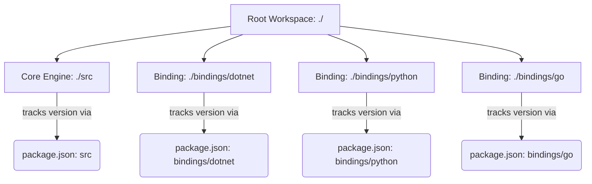
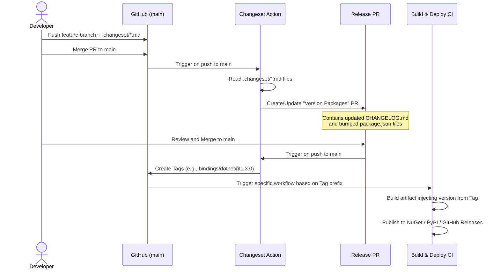

# Changesets Implementation Plan for DecentDB

This document outlines the strategy for migrating DecentDB's monolithic repository to an independently versioned "polyglot monorepo" using **Changesets**.

## Why Changesets?

As DecentDB grows, tying the core database version to the version of every language binding creates unnecessary noise. A patch to the `.NET` binding should not force a version bump for the `Python` binding or the `Nim` core.

We want to keep the monorepo for developer velocity (atomic commits, unified testing) but decouple the release pipelines. Changesets allows us to:
1. Version the Core and Bindings independently.
2. Generate beautiful, component-specific changelogs (or one unified one).
3. Easily fix "oopsies" by editing simple Markdown files before release.
4. Avoid strict, rigid commit message requirements (like Conventional Commits).

---

## 1. Architectural Overview

### The "Dummy package.json" Strategy
Changesets was originally built for JavaScript (NPM) monorepos. To use it in a polyglot repository (Nim, C#, Python, Go), we will use a **"Publish-Free" Workspace Strategy**.

We will place a minimalist `package.json` file in each component's directory. These files will not be published to NPM; they act purely as a **state tracker** for Changesets to know the current version of each component.



### The CI/CD Pipeline Flow
Instead of hardcoding versions in `.csproj`, `.nimble`, or `setup.py` files, those files will either remain static or be dynamically injected by GitHub Actions at build time based on the Git Tag created by Changesets.



---

## 2. Step-by-Step Implementation Setup

### Step 2.1: Initialize the Workspace
At the root of the repository, initialize a Node workspace to manage the Changesets CLI.

1. Create a `package.json` in the root:
```json
{
  "name": "decentdb-monorepo",
  "private": true,
  "workspaces": [
    "src",
    "bindings/*"
  ],
  "devDependencies": {
    "@changesets/cli": "^2.27.1",
    "@changesets/changelog-github": "^0.5.0"
  }
}
```

2. Create a minimal `package.json` in `src/` and every binding folder *except Node*.
**CRITICAL: Tag Naming Convention**
To be compatible with Go Modules (which have strict tagging requirements), we will name our packages exactly as their folder paths appear from the root. 

Example for `bindings/dotnet/package.json`:
```json
{
  "name": "bindings/dotnet",
  "version": "1.0.0",
  "private": true
}
```
Example for `src/package.json` (Core):
```json
{
  "name": "src",
  "version": "1.0.0",
  "private": true
}
```

#### Special Case: The Node.js Binding
You **do not** need to create a dummy `package.json` for `bindings/node`. You will use your *real* `package.json` for the Node binding. Changesets will treat it as a first-class citizen, physically updating the `"version"` field inside it during the release PR generation. 

*Important:* To ensure your Git tags are consistent and compatible across the monorepo, verify the `"name"` field in `bindings/node/package.json` is set to `bindings/node`. If you publish to NPM under a different name (e.g., `decentdb`), you will handle that mapping in your CI publish step.

### Step 2.2: Configure Changesets
Run `npx changeset init` at the root. This creates a `.changeset/config.json` file.
Update it to look like this:

```json
{
  "$schema": "https://unpkg.com/@changesets/config@3.0.0/schema.json",
  "changelog": [
    "@changesets/changelog-github",
    { "repo": "YOUR_ORG/decentdb" }
  ],
  "commit": false,
  "fixed": [],
  "linked": [],
  "access": "restricted",
  "baseBranch": "main",
  "updateInternalDependencies": "patch",
  "ignore": []
}
```

---

## 3. The Developer Workflow (Day-to-Day)

When you finish a feature, fix a bug, or make any change that warrants a release, you do the following before you commit:

1. Open your terminal in the root directory.
2. Run `npx changeset`.
3. An interactive prompt will ask you:
   - **Which packages to bump?** (Use spacebar to select `@decentdb/core`, `@decentdb/dotnet`, etc.)
   - **What type of bump?** (Major, Minor, or Patch)
   - **What is the changelog summary?** (e.g., "Added async queries to .NET wrapper").
4. This generates a temporary markdown file in the `.changeset/` folder (e.g., `.changeset/smooth-apples-jump.md`).
5. Commit this markdown file along with your code changes.

*Fixing Oopsies:* If you realize you chose "Minor" instead of "Patch", or you made a typo in the changelog, just open the `.changeset/smooth-apples-jump.md` file in VS Code, manually edit the text, and commit the fix. It's that easy.

---

## 4. Modifying GitHub Actions

Currently, DecentDB relies on `release.yml` and `nuget.yml` to publish artifacts. We need to split the responsibilities: one Action handles Changeset logic, and the existing Actions handle artifact publishing when tags are created.

### Action 1: The Changeset Bot (New)
Create `.github/workflows/changesets.yml`:

```yaml
name: Changesets
on:
  push:
    branches:
      - main

permissions:
  contents: write
  pull-requests: write

jobs:
  version-and-publish:
    runs-on: ubuntu-latest
    steps:
      - uses: actions/checkout@v4
      - uses: actions/setup-node@v4
        with:
          node-version: 20
      - run: npm install
      
      - name: Create Release PR or Publish Tags
        id: changesets
        uses: changesets/action@v1
        with:
          # CRITICAL LINE: 
          # Stops Changesets from automatically running `npm publish` 
          # on the `bindings/node` package. It only creates Git tags!
          publish: npx changeset tag
        env:
          GITHUB_TOKEN: ${{ secrets.GITHUB_TOKEN }}
```
*Note on `publish: npx changeset tag`: Because we are managing a polyglot monorepo, we want consistency. We neuter Changeset's ability to automatically publish the real Node.js package to NPM so that our CI pipelines remain standardized across all languages. The tags will trigger a separate `.github/workflows/node.yml` file to handle the actual publishing.*

### Action 2: Adapting the .NET Release (`nuget.yml`)
Modify the existing `.github/workflows/nuget.yml` to trigger *only* when the .NET tag is pushed, and inject the version into the build.

```yaml
name: Publish .NET
on:
  push:
    tags:
      - 'bindings/dotnet@*' # Triggered by Changesets

jobs:
  publish:
    runs-on: ubuntu-latest
    steps:
      - uses: actions/checkout@v4
      
      - name: Extract Version
        id: extract_version
        # Strips 'bindings/dotnet@' from the tag to get '1.3.0'
        run: echo "VERSION=${GITHUB_REF#refs/tags/bindings/dotnet@}" >> $GITHUB_ENV

      - name: Setup .NET
        uses: actions/setup-dotnet@v4
        with:
          dotnet-version: 8.0.x
          
      # The magic: Pass the extracted version directly into the MSBuild pipeline
      - name: Pack
        run: dotnet pack bindings/dotnet/DecentDB.csproj -c Release /p:PackageVersion=${{ env.VERSION }}
        
      - name: Push to NuGet
        run: dotnet nuget push **/*.nupkg -k ${{ secrets.NUGET_API_KEY }} -s https://api.nuget.org/v3/index.json
```

### Action 3: Adapting the Core Release (`release.yml`)
Modify `release.yml` to trigger on `src@*`. 

```yaml
name: Release Core
on:
  push:
    tags:
      - 'src@*'

jobs:
  build-and-release:
    # Build Nim shared libraries...
    # Create GitHub Release attached to the tag...
    # Upload assets...
```

---

## 5. Potential Pitfalls and Considerations

1. **Native Version Strings**: If your Nim or Python code expects to be able to read its own version at runtime (e.g., `DecentDB.Version() -> "1.2.0"`), dynamically injecting it via CLI arguments during CI might require minor code tweaks. For Nim, you can use `-d:DecentDbVersion="1.2.0"`. For Python, tools like `setuptools_scm` can read the git tag automatically.
2. **The "Empty" Commit**: When you merge the "Version Packages" PR, Changesets creates an empty commit just to attach the tags to the `CHANGELOG.md` updates.
3. **Changelog Formatting**: Changesets will generate a `CHANGELOG.md` inside `src/` and inside each `bindings/*` folder. If you want a unified changelog at the root instead, you will need to write a small custom script to aggregate them, or simply link to the sub-folder changelogs from the main README.
4. **Go Tag Format Nuance**: Changesets creates tags in the format `package-name@version` (e.g., `bindings/go@1.2.3`). However, Go modules strictly require the format `bindings/go/v1.2.3`. You will need to add a post-tag script in the Changeset GitHub Action to detect `bindings/go@X.Y.Z` tags and automatically create and push a `bindings/go/vX.Y.Z` alias tag.

---

## 6. Implementation Guide for Coding Agents

If an autonomous agent is helping to implement this plan, execute the setup in the following isolated phases:

### Phase 1: Workspace & State Initialization
1. Create the root `package.json` with the workspace configuration.
2. Traverse the repository and create the dummy `package.json` files for `src` and all `bindings/*` directories (excluding `node`). Ensure the `"name"` strictly matches the directory path (e.g., `"name": "bindings/python"`).
3. Verify the existing `bindings/node/package.json` name is updated to `bindings/node`.
4. Run `npx changeset init` in the root and configure `.changeset/config.json`.
5. Commit this as "chore: setup changesets workspace".

### Phase 2: GitHub Actions Reconfiguration
1. Create `.github/workflows/changesets.yml` as defined in Step 4. Ensure `publish: npx changeset tag` is strictly set to prevent accidental NPM publishes.
2. **Path Filtering Update**: Update the main PR/Push workflow (e.g., `ci.yml`) to use `paths` filtering. Ensure core tests only run when `src/**` changes, and language tests only run when their respective `bindings/*/**` or `src/**` changes. This prevents CI minute explosion.
3. Update all release workflows (e.g., `release.yml`, `nuget.yml`) to trigger on their new tag prefixes (e.g., `on: push: tags: - 'src@*'`) and dynamically inject the version number from the tag during the build step.
4. Add a specific step in the Changeset workflow to handle Go module tag aliases as described in Step 5 (Pitfall #4).
5. Commit this as "ci: migrate release pipelines to changesets".
