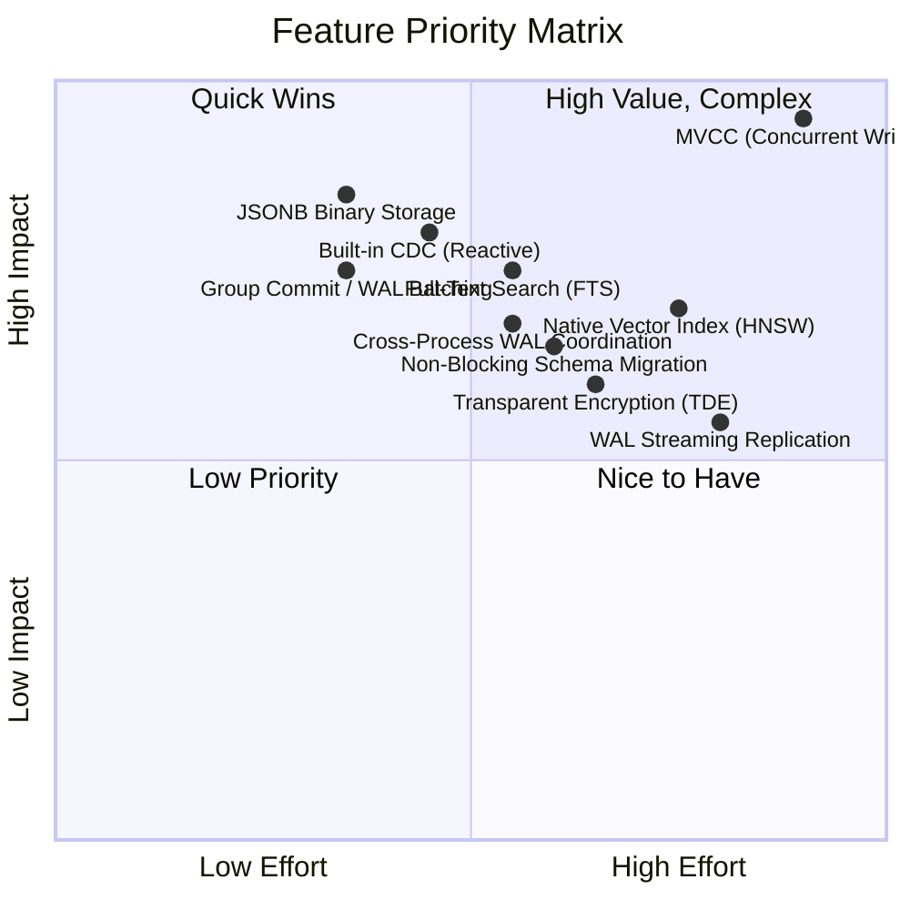
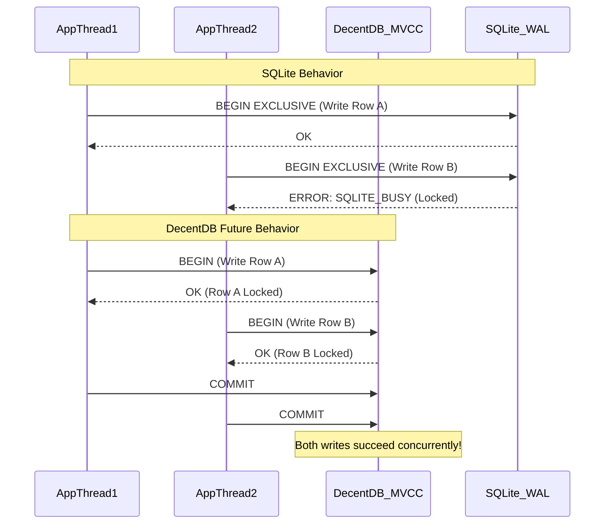
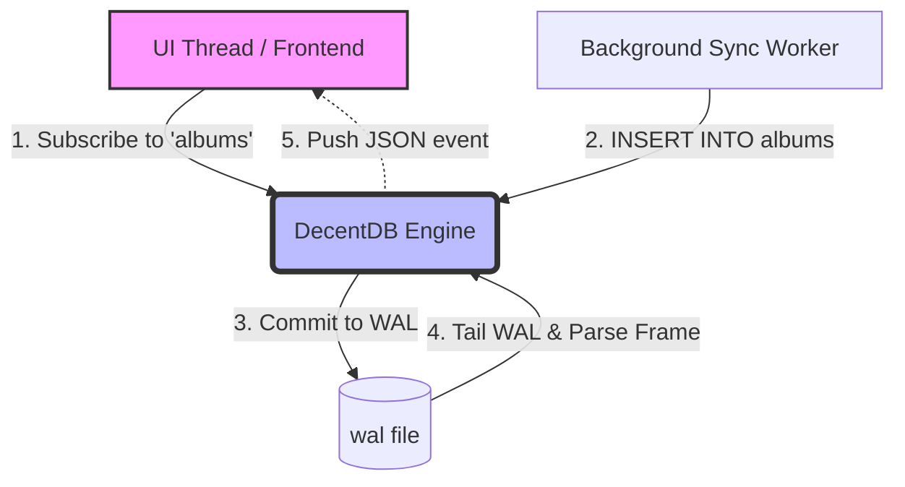
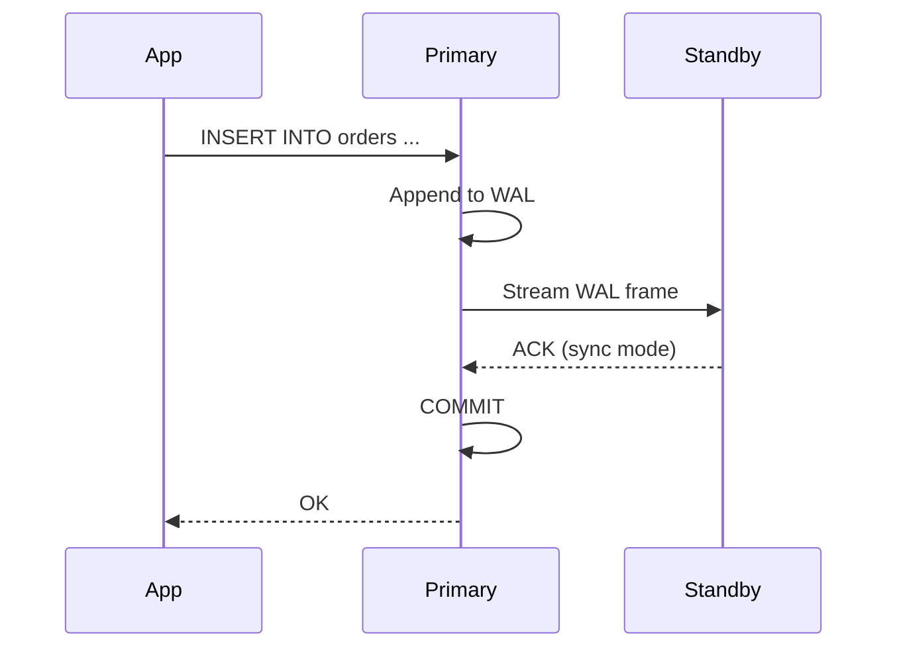
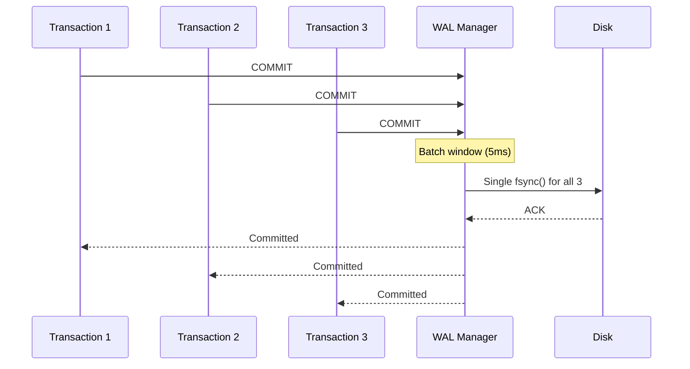

# DecentDB: Future Wins & Bragging Rights

This document outlines a roadmap of high-impact features we can add to DecentDB to position it as a superior alternative to SQLite for modern application development. By targeting SQLite's historical architectural compromises and the most common developer pain points, DecentDB can become the engine of choice for developers building everything from local-first web apps to complex embedded systems.

---

## Effort vs. Impact Matrix

To help prioritize these features, here is an Effort vs. Impact matrix. 
- **Impact** measures the value-add to the developer (solving major pain points, providing a "wow" factor).
- **Effort** measures the engineering complexity required to implement the feature within DecentDB's existing architecture.



#### ⏳ Recommended Next Wins

| Feature | Section |
|---|---|
| JSONB binary storage | Section 2 below |
| CDC / Reactive Subscriptions | Section 3 below |
| MVCC | Section 1 below |
| Vector / HNSW Index | Section 4 below |
| Transparent Data Encryption | Section 5 below |
| Full-Text Search (FTS) | Section 6 below |
| Non-Blocking Schema Migration | Section 7 below |
| WAL Streaming Replication | Section 8 below |
| Bulk Load Follow-Ons | Section 9 below |
| Group Commit / WAL Batching | Section 10 below |
| Cross-Process WAL Coordination | Section 11 below |

---

## 1. Multi-Version Concurrency Control (MVCC) for Concurrent Writers

### The SQLite Pain Point
SQLite uses database-level (or WAL-level) write locks. While Write-Ahead Logging (WAL) allows concurrent readers alongside a *single* writer, any application with high write concurrency inevitably hits `SQLITE_BUSY` errors. Developers are forced to implement complex in-application queuing, connection pooling workarounds, or retry logic.

### The DecentDB Win
Implement true **Multi-Version Concurrency Control (MVCC)** or **Row-Level Locking**. By allowing multiple transactions to write to different rows simultaneously without blocking each other, DecentDB would completely eliminate the `SQLITE_BUSY` bottleneck. This transforms DecentDB from a "single-user embedded database" into an embedded engine capable of handling high-throughput, multi-threaded server workloads directly.



---

## 2. JSONB Binary Storage

### Already Implemented: Native Rich Types

DecentDB already ships native rich types that SQLite lacks:

*   **`TIMESTAMP`** (ADR 0114): Stored as zigzag-varint int64 of microseconds since Unix epoch UTC. Type is fully implemented with binding support across .NET, Python, Java, Node.js, and Go. `NOW()`, `CURRENT_TIMESTAMP`, and `EXTRACT()` functions are fully wired.
*   **`UUID`** (ADR 0072, 0091): Stored as a highly optimized 16-byte packed structure (`ColumnType::Uuid`). `GEN_RANDOM_UUID()` is implemented and works in DEFAULT expressions.
*   **`DECIMAL`** (ADR 0072, 0091): Stored as scaled int64 with explicit scale, avoiding floating-point rounding errors.
*   **JSON scalar functions** (ADR 0102): `json_extract()`, `json_array_length()`, `->`, `->>` operators, and `json_each()`, `json_tree()` table-valued functions are fully implemented.

### The Remaining SQLite Pain Point: JSON as Plain Text
SQLite stores JSON as plain text. Querying JSON requires parsing the string at runtime for *every* row evaluated. While DecentDB already provides `json_extract()` and `json_array_length()` scalar functions (ADR 0102), the underlying storage is still text — the parser runs on every access.

### The DecentDB Win: JSONB
Introduce **JSONB** — Binary JSON (like PostgreSQL). Queries traverse the binary structure directly without parsing strings, making JSON indexing and querying orders of magnitude faster than text-based JSON.


---

## 3. Built-in Change Data Capture (CDC) & Reactive Subscriptions

### The SQLite Pain Point
Local-first applications (React, Vue, Svelte) and edge architectures need to react to database changes in real-time. Syncing SQLite to an external database or updating a UI requires complex trigger-based workarounds, polling, or heavy external syncing libraries (like ElectricSQL or PowerSync).

### The DecentDB Win
Build a **Native Publish-Subscribe API** by tailing the Write-Ahead Log (WAL). Applications can simply run `SELECT * FROM listen_changes('users')` or hook a callback into the engine to receive an instant, ordered stream of inserts, updates, and deletes as they are committed. 



---

## 4. Native Vector/Embedding Indexes (HNSW)

### The SQLite Pain Point
With the explosion of AI, LLMs, and Retrieval-Augmented Generation (RAG), vector similarity search is a baseline requirement. SQLite users must compile, load, and manage fragile external C-extensions like `sqlite-vss` or `sqlite-vec`. This breaks the "it just works everywhere" promise of embedded databases, especially in mobile or cross-platform CI/CD pipelines.

### The DecentDB Win
Provide a native `VECTOR(dim)` data type and an integrated **HNSW (Hierarchical Navigable Small World) Index**. Developers get out-of-the-box, lightning-fast similarity search (e.g., `SELECT * FROM docs ORDER BY embedding <=> '[0.1, 0.5, ...]' LIMIT 5`) with zero external dependencies.

---

## 5. Transparent Data Encryption (TDE)

### The SQLite Pain Point
If you need an encrypted database on iOS, Android, or desktop (to comply with HIPAA/GDPR), vanilla SQLite cannot help you. You must use **SQLCipher**. SQLCipher requires commercial licensing for many use cases, relies on custom builds, causes massive friction with standard ORMs, and is famously difficult to compile cross-platform.

### The DecentDB Win
Built-in **Page-Level AES-256-GCM Encryption**. Since DecentDB controls the Pager, we can intercept page flushes and reads. The developer simply executes `PRAGMA encryption_key = 'super_secret';` upon connection. The engine transparently encrypts data at rest, including the WAL and temporary files, with zero external build dependencies.

---

## 6. Full-Text Search (FTS) with Ranking

### The SQLite Pain Point
SQLite requires the external FTS5 extension for full-text search. While functional, it must be compiled, loaded, and managed separately. Developers face cross-platform build friction, and the extension lacks native integration with the query planner — FTS queries use virtual table syntax rather than standard SQL.

### The DecentDB Win
Provide a native `TSVECTOR` type and `TSQUERY` operators with integrated **BM25 ranking**, stemming, and phrase search. Developers write standard SQL:

```sql
CREATE INDEX docs_fts ON documents USING gin (to_tsvector('english', body));
SELECT id, ts_rank_cd(to_tsvector('english', body), query) AS rank
FROM documents, plainto_tsquery('embedded database') query
WHERE to_tsvector('english', body) @@ query
ORDER BY rank DESC
LIMIT 10;
```

No extensions, no build steps, no virtual tables — just SQL.

---

## 7. Non-Blocking Schema Migration

### The SQLite Pain Point
SQLite's `ALTER TABLE` is limited to `ADD COLUMN` and `RENAME TABLE`. Modifying a column type, adding a constraint, or dropping a column requires creating a new table, copying all data, dropping the old table, and renaming — all while holding an exclusive lock. For large databases, this blocks all reads and writes for minutes or hours.

### Current DecentDB Status
DecentDB is already ahead of SQLite here in raw DDL coverage: `ALTER TABLE` can add columns, drop columns, rename columns, and perform a limited set of type changes. The remaining gap is that these operations are still synchronous, guarded, and blocking rather than background or lazily migrated.

### The DecentDB Win
Implement **background schema migrations** that don't block reads or writes. The engine maintains both old and new schema versions simultaneously, migrates rows lazily in the background, and atomically swaps the catalog entry when complete:

```sql
-- Instant: adds column metadata, no table copy
ALTER TABLE users ADD COLUMN email TEXT;

-- Background: rebuilds table with new column type, non-blocking
ALTER TABLE users ALTER COLUMN age SET DATA TYPE BIGINT;

-- Background: drops column, non-blocking
ALTER TABLE users DROP COLUMN legacy_field;
```

This is a significant differentiator for applications with evolving schemas and large datasets.

---

## 8. WAL Streaming Replication

### The SQLite Pain Point
SQLite has no native replication. Developers who need high availability or read scaling must use external tools like Litestream (WAL shipping to S3), LiteFS (FUSE-based replication), or custom solutions. These add operational complexity, external dependencies, and often introduce consistency trade-offs.

### The DecentDB Win
Build **native WAL streaming** to a standby database with configurable consistency levels:

*   **Async:** Standby lags behind primary; lowest latency on writes.
*   **Sync:** Primary waits for standby acknowledgment before committing; zero data loss.
*   **Quorum:** Primary waits for N of M standbys; balances latency and durability.



This enables embedded databases that survive hardware failures without external tooling.

---

## 9. Bulk Load Follow-Ons

### Current DecentDB Status
DecentDB already ships a bulk load API in the engine. That means bulk ingestion should no longer be treated as a missing differentiator; the roadmap item now is to extend the shipped foundation into a stronger end-user workflow.

### The Next DecentDB Win
Build higher-level bulk-ingest workflows on top of the existing API:

*   COPY-style SQL or CLI commands for CSV/JSON ingestion
*   Streaming readers for datasets larger than memory
*   Smarter sorted-input hints for index-friendly loading
*   Better progress reporting and resumable import ergonomics

```rust
// Rust API
let mut loader = db.bulk_loader()
    .table("events")
    .columns(&["id", "timestamp", "payload"])
    .batch_size(10_000)
    .start()?;

loader.write_row(&[1i64, ts, json])?;
loader.write_row(&[2i64, ts2, json2])?;
loader.finish()?;
```

This makes DecentDB competitive for ETL pipelines and data migration scenarios.

---

## 10. Group Commit / WAL Batching

### The SQLite Pain Point
SQLite's WAL mode commits each transaction with an `fsync()` call. While durable, this creates a hard limit on write throughput — typically 100-500 TPS on consumer SSDs. High-throughput applications must batch at the application layer.

### The DecentDB Win
Implement **group commit** (ADR 0037) that batches multiple concurrent transactions into a single WAL sync:

*   Multiple transactions share a single `fsync()` when committing simultaneously
*   Configurable latency budget (e.g., 1-10ms batching window)
*   No durability compromise — each transaction still gets a committed LSN



This can increase write throughput by 3-10x without sacrificing durability.

---

## 11. Cross-Process WAL Coordination

### Current DecentDB Status
DecentDB already has a shared WAL registry for multiple connections inside the same process. That solves same-process visibility and removes reopen churn, but it does not yet deliver true cross-process coordination.

### The SQLite Pain Point
SQLite allows multiple reader processes but only one writer process at a time. Multi-process architectures (common in Electron apps, microservices, or plugin systems) must coordinate writes through connection pooling or external orchestration.

### The DecentDB Win
Extend the current shared-WAL design into **coordinated multi-process access**:

*   Multiple processes can open the same database file
*   Writer coordination via file locks or shared memory
*   Readers see consistent snapshots across process boundaries
*   WAL retention for long-running cross-process readers

This enables architectures where a background sync process writes while a foreground UI process reads — all without external coordination libraries.

---

## Conclusion

DecentDB has already shipped significant differentiators from SQLite, and this document should treat them as foundations rather than future ideas:

*   **Native rich types:** TIMESTAMP, UUID, DECIMAL with proper storage formats
*   **Advanced indexing:** Trigram indexes for `LIKE '%pattern%'`, plus shipping expression and partial indexes within the current v1 subset
*   **Modern SQL:** Recursive CTEs, savepoints, generated columns, temp tables, and a focused first slice of window functions
*   **Upsert support:** `INSERT ... ON CONFLICT DO UPDATE/NOTHING` and `INSERT ... RETURNING`
*   **ORM integration:** Native EF Core provider with query translation
*   **Developer experience:** In-memory VFS for testing, cost-based optimizer, bulk load API, and shared WAL visibility across same-process connections

The remaining roadmap items now break cleanly into two groups: short-horizon finish work and long-horizon platform bets.

| Category | Features |
|----------|----------|
| **Finish the Surface Area** | JSON table functions/operators, Date/Time builtins, UUID generation, Planner statistics / `ANALYZE` |
| **Performance** | JSONB, Group Commit, Bulk Load follow-ons |
| **Concurrency** | MVCC, Cross-process WAL coordination |
| **Real-time** | CDC / Reactive Subscriptions |
| **AI/ML** | Vector / HNSW Index |
| **Security** | Transparent Data Encryption |
| **Search** | Full-Text Search with BM25 |
| **Operations** | Non-blocking schema migration, WAL streaming replication |

By executing on these features, DecentDB shifts from being "another embedded database" to an indispensable, modern infrastructure component that actively solves the hardest parts of local-first development, AI integration, and high-concurrency embedded systems.
