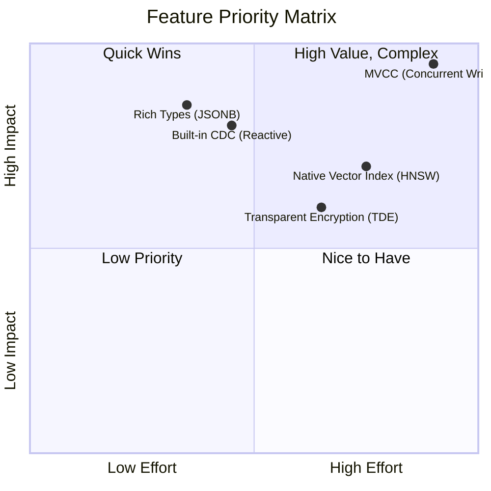
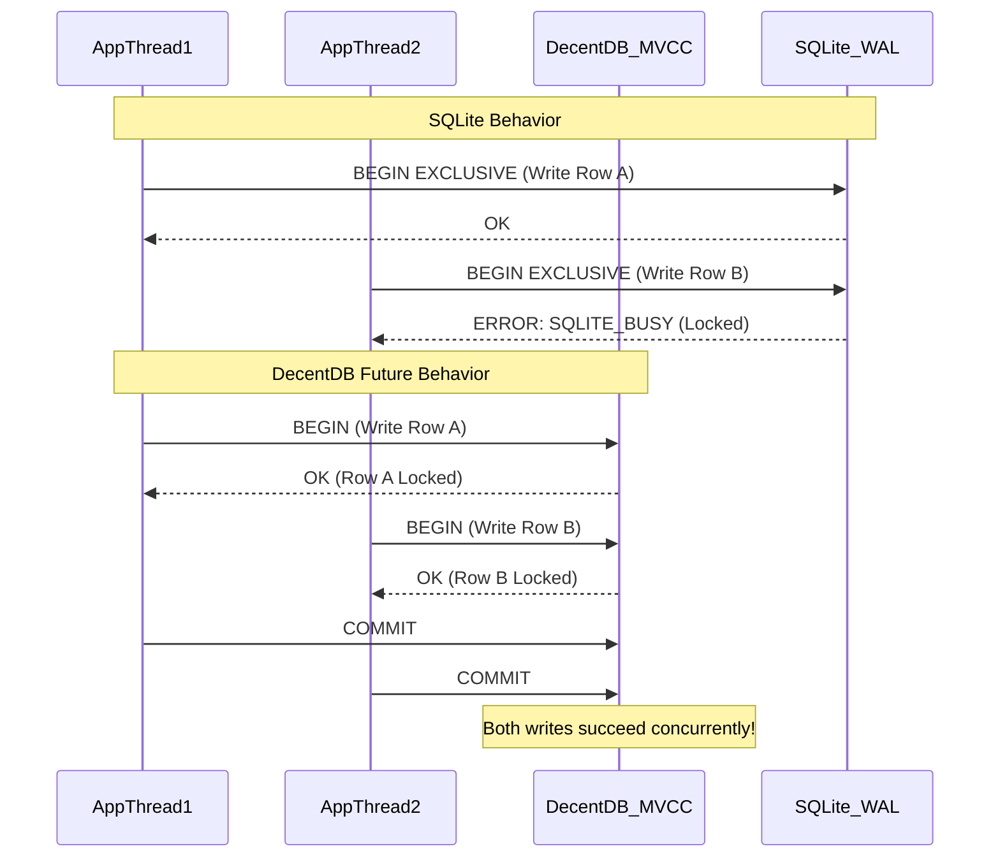
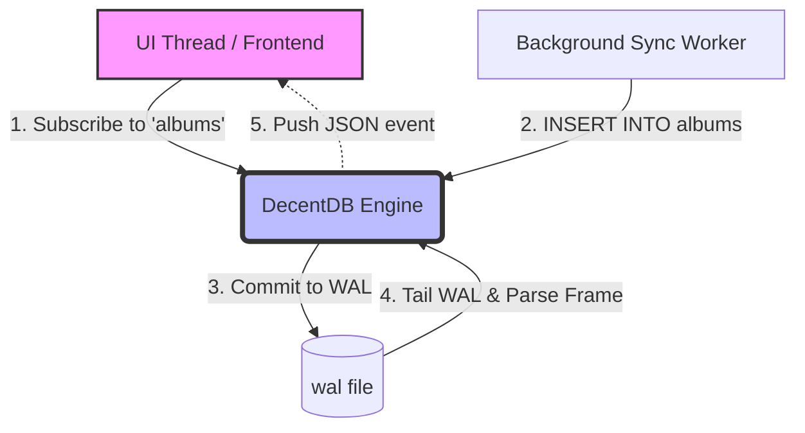

# DecentDB: Future Wins & Bragging Rights

This document outlines a roadmap of high-impact features we can add to DecentDB to position it as a superior alternative to SQLite for modern application development. By targeting SQLite's historical architectural compromises and the most common developer pain points, DecentDB can become the engine of choice for developers building everything from local-first web apps to complex embedded systems.

---

## Effort vs. Impact Matrix

To help prioritize these features, here is an Effort vs. Impact matrix. 
- **Impact** measures the value-add to the developer (solving major pain points, providing a "wow" factor).
- **Effort** measures the engineering complexity required to implement the feature within DecentDB's existing architecture.

### The Strategy
*   **Start with Quadrant 2 (Top Left - Quick Wins):** **Rich Types (JSONB)** and **Built-in CDC**. These provide massive bragging rights against SQLite with relatively manageable changes to the current storage and WAL engines.
*   **The Ultimate Goal (Top Right - High Value, Complex):** **MVCC**. This requires a rewrite of the transaction and locking mechanisms, but it completely changes the category of applications DecentDB can support.

---

## 1. Multi-Version Concurrency Control (MVCC) for Concurrent Writers

### The SQLite Pain Point
SQLite uses database-level (or WAL-level) write locks. While Write-Ahead Logging (WAL) allows concurrent readers alongside a *single* writer, any application with high write concurrency inevitably hits `SQLITE_BUSY` errors. Developers are forced to implement complex in-application queuing, connection pooling workarounds, or retry logic.

### The DecentDB Win
Implement true **Multi-Version Concurrency Control (MVCC)** or **Row-Level Locking**. By allowing multiple transactions to write to different rows simultaneously without blocking each other, DecentDB would completely eliminate the `SQLITE_BUSY` bottleneck. This transforms DecentDB from a "single-user embedded database" into an embedded engine capable of handling high-throughput, multi-threaded server workloads directly.

---

## 2. First-Class Native "Rich" Types (JSONB, DateTime)

### The SQLite Pain Point
SQLite uses "Flexible Typing" (Manifest Typing), meaning any column can store any data type regardless of its declaration (though `STRICT` tables help). Crucially, SQLite lacks native, optimized storage for modern application data:
*   **Dates/Times:** Stored as strings or reals, requiring constant function parsing on every query (`strftime()`).
*   **JSON:** Stored as plain text. Querying JSON requires parsing the string at runtime for *every* row evaluated.

### The DecentDB Win
DecentDB can introduce strict typing by default with **native binary representations** of rich types:
*   `DateTime`: Stored as an integer epoch with integrated time-zone awareness.
*   `JSONB`: Binary JSON (like PostgreSQL). Queries traverse the binary structure directly without parsing strings, making JSON indexing and querying orders of magnitude faster than SQLite.

*(Note: Native `UUID` support has already been implemented as a highly optimized 16-byte packed structure!)*

---

## 3. Built-in Change Data Capture (CDC) & Reactive Subscriptions

### The SQLite Pain Point
Local-first applications (React, Vue, Svelte) and edge architectures need to react to database changes in real-time. Syncing SQLite to an external database or updating a UI requires complex trigger-based workarounds, polling, or heavy external syncing libraries (like ElectricSQL or PowerSync).

### The DecentDB Win
Build a **Native Publish-Subscribe API** by tailing the Write-Ahead Log (WAL). Applications can simply run `SELECT * FROM listen_changes('users')` or hook a callback into the engine to receive an instant, ordered stream of inserts, updates, and deletes as they are committed. 

---

## 4. Native Vector/Embedding Indexes (HNSW)

### The SQLite Pain Point
With the explosion of AI, LLMs, and Retrieval-Augmented Generation (RAG), vector similarity search is a baseline requirement. SQLite users must compile, load, and manage fragile external C-extensions like `sqlite-vss` or `sqlite-vec`. This breaks the "it just works everywhere" promise of embedded databases, especially in mobile or cross-platform CI/CD pipelines.

### The DecentDB Win
Provide a native `VECTOR(dim)` data type and an integrated **HNSW (Hierarchical Navigable Small World) Index**. Developers get out-of-the-box, lightning-fast similarity search (e.g., `SELECT * FROM docs ORDER BY embedding <=> '[0.1, 0.5, ...]' LIMIT 5`) with zero external dependencies.

---

## 5. Transparent Data Encryption (TDE)

### The SQLite Pain Point
If you need an encrypted database on iOS, Android, or desktop (to comply with HIPAA/GDPR), vanilla SQLite cannot help you. You must use **SQLCipher**. SQLCipher requires commercial licensing for many use cases, relies on custom builds, causes massive friction with standard ORMs, and is famously difficult to compile cross-platform.

### The DecentDB Win
Built-in **Page-Level AES-256-GCM Encryption**. Since DecentDB controls the Pager, we can intercept page flushes and reads. The developer simply executes `PRAGMA encryption_key = 'super_secret';` upon connection. The engine transparently encrypts data at rest, including the WAL and temporary files, with zero external build dependencies.

---

### Conclusion
By executing on these features, DecentDB shifts from being just "another embedded database" to an indispensable, modern infrastructure component that actively solves the hardest parts of local-first development, AI integration, and high-concurrency embedded systems.
