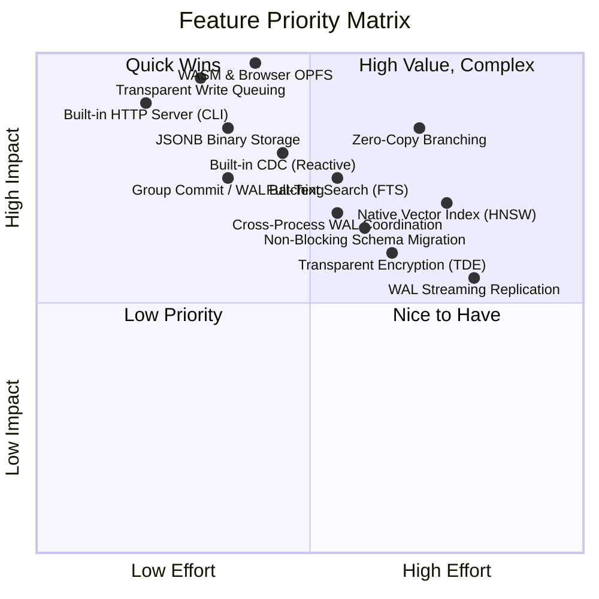
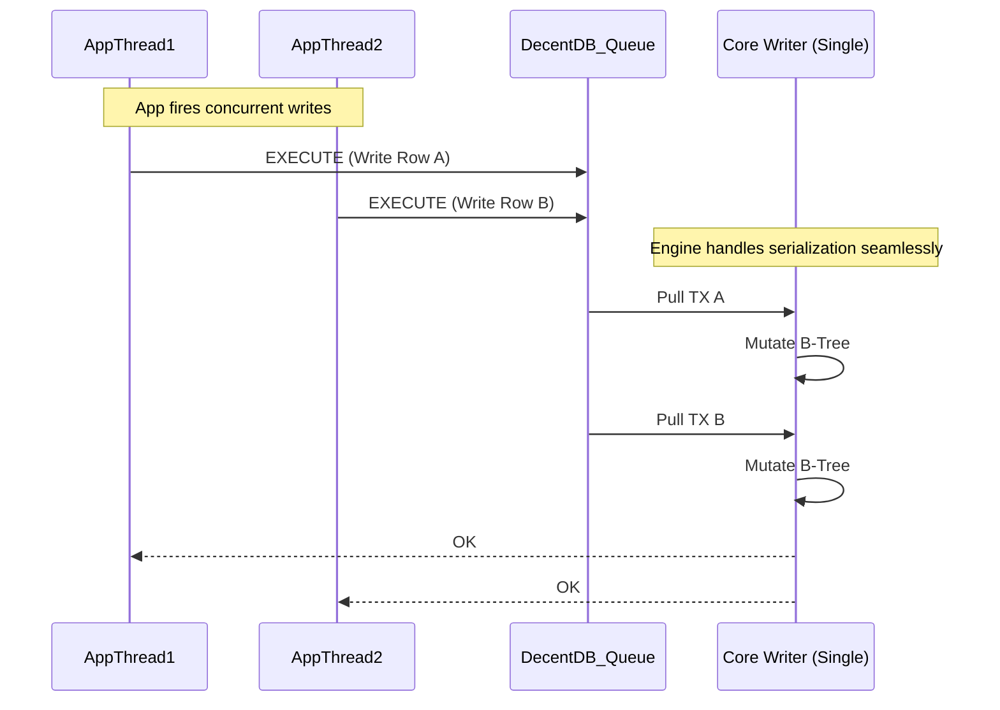
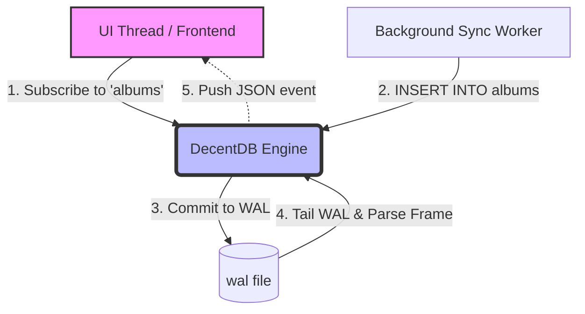
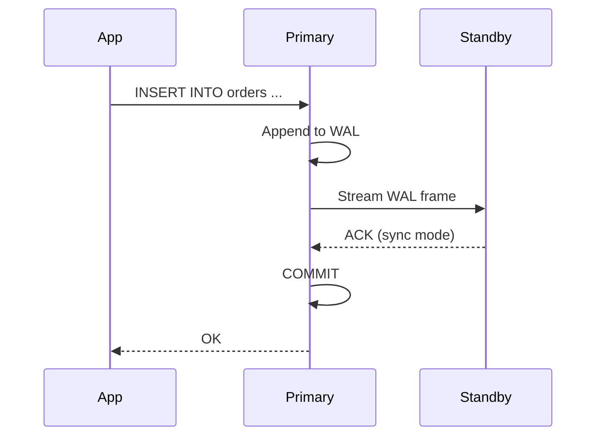
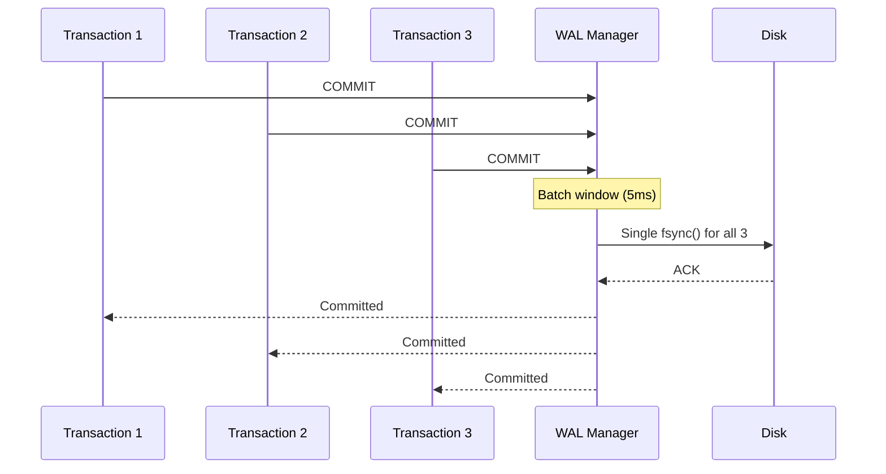

# DecentDB: Future Wins & Bragging Rights

This document outlines a roadmap of high-impact features we can add to DecentDB to position it as a superior alternative to SQLite for modern application development. By targeting SQLite's historical architectural compromises and the most common developer pain points, DecentDB can become the engine of choice for developers building everything from local-first web apps to complex embedded systems.

---

## Effort vs. Impact Matrix

To help prioritize these features, here is an Effort vs. Impact matrix. 
- **Impact** measures the value-add to the developer (solving major pain points, providing a "wow" factor).
- **Effort** measures the engineering complexity required to implement the feature within DecentDB's existing architecture.



#### ⏳ Recommended Next Wins (Ranked by Priority)

| Priority | Feature | Section |
|---|---|---|
| 1 | First-Class WASM & Browser Support | Section 12 below |
| 2 | Transparent Write Queuing | Section 1 below |
| 3 | JSONB Binary Storage | Section 2 below |
| 4 | Native Vector Index (HNSW) | Section 4 below |
| 5 | CDC & Reactive Subscriptions | Section 3 below |
| 6 | Built-in HTTP / Remote Server Mode | Section 13 below |
| 7 | WAL Streaming Replication | Section 8 below |
| 8 | Zero-Copy Database Branching | Section 14 below |
| 9 | Bulk Load Follow-Ons | Section 9 below |
| 10 | Group Commit / WAL Batching | Section 10 below |
| 11 | Transparent Data Encryption (TDE) | Section 5 below |
| 12 | Full-Text Search (FTS) | Section 6 below |
| 13 | Non-Blocking Schema Migration | Section 7 below |
| 14 | Cross-Process WAL Coordination | Section 11 below |

---

## 1. Transparent Write Queuing & Pipelining

### The SQLite Pain Point
SQLite uses database-level (or WAL-level) write locks. While Write-Ahead Logging (WAL) allows concurrent readers alongside a *single* writer, any application with high write concurrency inevitably hits `SQLITE_BUSY` errors. Developers are forced to implement complex in-application queuing, connection pooling workarounds, or retry logic, pushing database orchestration burden onto the application layer.

### The DecentDB Win
Instead of exposing write locks to the developer or abandoning the ACID safety of Rust's single-writer `&mut` model, DecentDB implements **Transparent Write Queuing**. When concurrent application threads execute writes, the database implicitly queues the transactions over an in-memory channel. The core engine process pulls these transactions sequentially, executing them blisteringly fast without locking contention, and returns success to all calling threads.

When paired with **Group Commit** (Section 10), the engine can sync a bundle of these concurrent writes in a single disk `fsync()`. To the developer, the embedded database swallows thousands of concurrent writes effortlessly—without a single `BUSY` error and with zero sacrifice to strict ACID durability.



---

## 2. JSONB Binary Storage

### Already Implemented: Native Rich Types

DecentDB already ships native rich types that SQLite lacks:

*   **`TIMESTAMP`** (ADR 0114): Stored as zigzag-varint int64 of microseconds since Unix epoch UTC. Type is fully implemented with binding support across .NET, Python, Java, Node.js, and Go. `NOW()`, `CURRENT_TIMESTAMP`, and `EXTRACT()` functions are fully wired.
*   **`UUID`** (ADR 0072, 0091): Stored as a highly optimized 16-byte packed structure (`ColumnType::Uuid`). `GEN_RANDOM_UUID()` is implemented and works in DEFAULT expressions.
*   **`DECIMAL`** (ADR 0072, 0091): Stored as scaled int64 with explicit scale, avoiding floating-point rounding errors.
*   **JSON scalar functions** (ADR 0102): `json_extract()`, `json_array_length()`, `->`, `->>` operators, and `json_each()`, `json_tree()` table-valued functions are fully implemented.

### The Remaining SQLite Pain Point: JSON as Plain Text
SQLite stores JSON as plain text. Querying JSON requires parsing the string at runtime for *every* row evaluated. While DecentDB already provides `json_extract()` and `json_array_length()` scalar functions (ADR 0102), the underlying storage is still text — the parser runs on every access.

### The DecentDB Win: JSONB
Introduce **JSONB** — Binary JSON (like PostgreSQL). Queries traverse the binary structure directly without parsing strings, making JSON indexing and querying orders of magnitude faster than text-based JSON.


### Implementation Guidelines for Agents

When implementing `JSONB`, agents must adhere to the following architecture constraints to maximize the Rust advantage and maintain C ABI stability:

1. **Zero-Copy Traversal via Pinned Pages:** Do not deserialize the binary format into an in-memory DOM or tree structure during query execution. A `JsonbValue<'a>` should simply wrap a `&'a [u8]` pointing directly into the Pager's pinned memory. Path evaluations (`->`, `->>`) must traverse offset headers in the binary slice directly.
2. **Stable Native Boundary (C ABI):** Do not force host language bindings (.NET, Python, Go) to write custom binary parsers. At the `decentdb.h` boundary, `JSONB` payloads should be eagerly serialized back to standard text JSON upon projection into the final result set, unless a raw blob is explicitly requested. The primary performance win relies on the execution engine avoiding parsing during `WHERE` clauses, joins, and index lookups—not on a specialized native return wire format.
3. **Synergy with Expression Indexes:** `JSONB` achieves its highest value when combined with DecentDB's existing expression index support. Ensure that extracting a scalar from JSONB (e.g., `data->>'id'`) correctly resolves to an extractable native type (like `INTEGER` or `TEXT`) that can be stored identically to primitives inside the B-Tree index keys.
4. **Transparent Page Overflow:** Do not invent bespoke TOAST or overflow logic for `JSONB`. Engine serialization should just produce a contiguous `[u8]` slice. If that cell exceeds the B-Tree's payload size limit, it should trigger DecentDB's standard B-Tree overflow page mechanism organically, just like large `TEXT` or `BLOB` fields.
5. **Mutation & the Single-Writer Model:** Partial updates (e.g., `UPDATE t SET col = jsonb_set(...)`) integrate natively into the existing transaction pipeline. The single writer reads the existing payload, reconstructs a new binary blob with the mutated values, and writes it as a new row to the WAL. Seeking a complex in-place page patching strategy is an anti-pattern that conflicts with DecentDB's simplicity goals.

---

## 3. Built-in Change Data Capture (CDC) & Reactive Subscriptions

### The SQLite Pain Point
Local-first applications (React, Vue, Svelte) and edge architectures need to react to database changes in real-time. Syncing SQLite to an external database or updating a UI requires complex trigger-based workarounds, polling, or heavy external syncing libraries (like ElectricSQL or PowerSync).

### The DecentDB Win
Build a **Native Publish-Subscribe API** by tailing the Write-Ahead Log (WAL). Applications can simply run `SELECT * FROM listen_changes('users')` or hook a callback into the engine to receive an instant, ordered stream of inserts, updates, and deletes as they are committed. 



---

## 4. Native Vector/Embedding Indexes (HNSW)

### The SQLite Pain Point
With the explosion of AI, LLMs, and Retrieval-Augmented Generation (RAG), vector similarity search is a baseline requirement. SQLite users must compile, load, and manage fragile external C-extensions like `sqlite-vss` or `sqlite-vec`. This breaks the "it just works everywhere" promise of embedded databases, especially in mobile or cross-platform CI/CD pipelines.

### The DecentDB Win
Provide a native `VECTOR(dim)` data type and an integrated **HNSW (Hierarchical Navigable Small World) Index**. Developers get out-of-the-box, lightning-fast similarity search (e.g., `SELECT * FROM docs ORDER BY embedding <=> '[0.1, 0.5, ...]' LIMIT 5`) with zero external dependencies.

---

## 5. Transparent Data Encryption (TDE)

### The SQLite Pain Point
If you need an encrypted database on iOS, Android, or desktop (to comply with HIPAA/GDPR), vanilla SQLite cannot help you. You must use **SQLCipher**. SQLCipher requires commercial licensing for many use cases, relies on custom builds, causes massive friction with standard ORMs, and is famously difficult to compile cross-platform.

### The DecentDB Win
Built-in **Page-Level AES-256-GCM Encryption**. Since DecentDB controls the Pager, we can intercept page flushes and reads. The developer simply executes `PRAGMA encryption_key = 'super_secret';` upon connection. The engine transparently encrypts data at rest, including the WAL and temporary files, with zero external build dependencies.

---

## 6. Full-Text Search (FTS) with Ranking

### The SQLite Pain Point
SQLite requires the external FTS5 extension for full-text search. While functional, it must be compiled, loaded, and managed separately. Developers face cross-platform build friction, and the extension lacks native integration with the query planner — FTS queries use virtual table syntax rather than standard SQL.

### The DecentDB Win
Provide a native `TSVECTOR` type and `TSQUERY` operators with integrated **BM25 ranking**, stemming, and phrase search. Developers write standard SQL:

```sql
CREATE INDEX docs_fts ON documents USING gin (to_tsvector('english', body));
SELECT id, ts_rank_cd(to_tsvector('english', body), query) AS rank
FROM documents, plainto_tsquery('embedded database') query
WHERE to_tsvector('english', body) @@ query
ORDER BY rank DESC
LIMIT 10;
```

No extensions, no build steps, no virtual tables — just SQL.

---

## 7. Non-Blocking Schema Migration

### The SQLite Pain Point
SQLite's `ALTER TABLE` is limited to `ADD COLUMN` and `RENAME TABLE`. Modifying a column type, adding a constraint, or dropping a column requires creating a new table, copying all data, dropping the old table, and renaming — all while holding an exclusive lock. For large databases, this blocks all reads and writes for minutes or hours.

### Current DecentDB Status
DecentDB is already ahead of SQLite here in raw DDL coverage: `ALTER TABLE` can add columns, drop columns, rename columns, and perform a limited set of type changes. The remaining gap is that these operations are still synchronous, guarded, and blocking rather than background or lazily migrated.

### The DecentDB Win
Implement **background schema migrations** that don't block reads or writes. The engine maintains both old and new schema versions simultaneously, migrates rows lazily in the background, and atomically swaps the catalog entry when complete:

```sql
-- Instant: adds column metadata, no table copy
ALTER TABLE users ADD COLUMN email TEXT;

-- Background: rebuilds table with new column type, non-blocking
ALTER TABLE users ALTER COLUMN age SET DATA TYPE BIGINT;

-- Background: drops column, non-blocking
ALTER TABLE users DROP COLUMN legacy_field;
```

This is a significant differentiator for applications with evolving schemas and large datasets.

---

## 8. WAL Streaming Replication

### The SQLite Pain Point
SQLite has no native replication. Developers who need high availability or read scaling must use external tools like Litestream (WAL shipping to S3), LiteFS (FUSE-based replication), or custom solutions. These add operational complexity, external dependencies, and often introduce consistency trade-offs.

### The DecentDB Win
Build **native WAL streaming** to a standby database with configurable consistency levels:

*   **Async:** Standby lags behind primary; lowest latency on writes.
*   **Sync:** Primary waits for standby acknowledgment before committing; zero data loss.
*   **Quorum:** Primary waits for N of M standbys; balances latency and durability.



This enables embedded databases that survive hardware failures without external tooling.

---

## 9. Bulk Load Follow-Ons

### Current DecentDB Status
DecentDB already ships a bulk load API in the engine. That means bulk ingestion should no longer be treated as a missing differentiator; the roadmap item now is to extend the shipped foundation into a stronger end-user workflow.

### The Next DecentDB Win
Build higher-level bulk-ingest workflows on top of the existing API:

*   COPY-style SQL or CLI commands for CSV/JSON ingestion
*   Streaming readers for datasets larger than memory
*   Smarter sorted-input hints for index-friendly loading
*   Better progress reporting and resumable import ergonomics

```rust
// Rust API
let mut loader = db.bulk_loader()
    .table("events")
    .columns(&["id", "timestamp", "payload"])
    .batch_size(10_000)
    .start()?;

loader.write_row(&[1i64, ts, json])?;
loader.write_row(&[2i64, ts2, json2])?;
loader.finish()?;
```

This makes DecentDB competitive for ETL pipelines and data migration scenarios.

---

## 10. Group Commit / WAL Batching

### The SQLite Pain Point
SQLite's WAL mode commits each transaction with an `fsync()` call. While durable, this creates a hard limit on write throughput — typically 100-500 TPS on consumer SSDs. High-throughput applications must batch at the application layer.

### The DecentDB Win
Implement **group commit** (ADR 0037) that batches multiple concurrent transactions into a single WAL sync:

*   Multiple transactions share a single `fsync()` when committing simultaneously
*   Configurable latency budget (e.g., 1-10ms batching window)
*   No durability compromise — each transaction still gets a committed LSN



This can increase write throughput by 3-10x without sacrificing durability.

---

## 11. Cross-Process WAL Coordination

### Current DecentDB Status
DecentDB already has a shared WAL registry for multiple connections inside the same process. That solves same-process visibility and removes reopen churn, but it does not yet deliver true cross-process coordination.

### The SQLite Pain Point
SQLite allows multiple reader processes but only one writer process at a time. Multi-process architectures (common in Electron apps, microservices, or plugin systems) must coordinate writes through connection pooling or external orchestration.

### The DecentDB Win
Extend the current shared-WAL design into **coordinated multi-process access**:

*   Multiple processes can open the same database file
*   Writer coordination via file locks or shared memory
*   Readers see consistent snapshots across process boundaries
*   WAL retention for long-running cross-process readers

This enables architectures where a background sync process writes while a foreground UI process reads — all without external coordination libraries.

---

## 12. First-Class WASM & Browser Support (OPFS VFS)

### The SQLite Pain Point
Building local-first web applications with SQLite in the browser is notoriously painful. The official `sqlite-wasm` build is large, and integrating it with the browser's Origin Private File System (OPFS) requires orchestrating complex Web Worker proxy bridges to avoid blocking the main UI thread.

### The DecentDB Win
Because DecentDB is pure Rust, it trivially compiles to `wasm32-unknown-unknown`. By providing a native, async-aware OPFS Virtual File System (VFS), DecentDB can become the de-facto standard for in-browser local-first relational databases. We can offer a deeply integrated JavaScript/TypeScript API that "just works" without developers having to wire up Web Workers manually, capturing the massive local-first frontend market.

### Implementation Guidelines for Agents

To deliver a frictionless WASM experience, the implementation should focus on the following technical strategies:

1. **Target Architecture:** Ensure the core engine remains fully compatible with the `wasm32-unknown-unknown` target. Isolate native OS features (like `std::fs`, raw threads, or blocking locks) through the VFS and OS interface traits.
2. **OPFS Synchronous Access:** The browser's maximum-speed file API (`createSyncAccessHandle`) is strictly limited to Dedicated Web Workers. The new `DecentDB_OpfsVfs` must be built around this synchronous API using `web-sys`.
3. **Transparent RPC Wrapper:** The official NPM package (`@decentdb/web`) should hide the worker entirely. The package should automatically spawn the Web Worker, load the WASM binary, and establish an efficient message-passing bridge. The main-thread developer simply calls an async API (`await db.query(...)`) without thinking about the underlying worker orchestration.
4. **Zero-Copy Memory Transfer:** When returning result sets from the WASM worker to the main JavaScript thread, leverage WebAssembly's flat memory model to slice read-only data and use transferable objects, avoiding expensive per-row JSON serialization and garbage collection pressure in V8.
5. **Durability Edge-Cases:** Browsers do not guarantee that OPFS data will live forever (it can be cleared under severe disk pressure). The JS API should expose native hooks to easily export/import the raw `db.ddb` binary file to/from `IndexedDB` or a cloud sync endpoint.

---

## 13. Built-in HTTP / Remote Server Mode (CLI)

### The SQLite Pain Point
SQLite is explicitly single-node and local. If developers need to access it over the network (e.g., from edge functions, serverless environments, or external BI tools), they have to wrap it in a custom HTTP API or use a heavily modified fork like LibSQL (Turso). 

### The DecentDB Win
Provide a tiny, zero-dependency `decentdb serve` command built directly into the `decentdb-cli`. Using a lightweight Rust HTTP framework (like `axum`), the CLI can expose a simple JSON/HTTP query endpoint over the core database file. This allows DecentDB to be used both as an embedded library *and* an edge-ready micro-server out of the box, cleanly separating the core engine from network exposure while delivering massive value to the user.

### Implementation Guidelines for Agents

To maintain architectural purity while delivering this feature, agents must adhere to the following boundaries:

1. **Strict Crate Isolation:** The `crates/decentdb` (core engine) must remain 100% agnostic to networking. It should contain no HTTP, TCP, or JSON-serialization dependencies. All server logic, routing, and connection handling must live exclusively inside the `crates/decentdb-cli` package.
2. **Stateless Request Model:** The HTTP API should be designed around stateless execution batches. Instead of maintaining long-lived stateful transactions over HTTP (which are fragile on edge networks), the endpoint should accept a JSON payload containing an array of SQL statements to execute atomically as a single transaction pipeline.
3. **Authentication Boundary:** Do not build a complex internal user role/permissions system. Expose a simple Shared Secret (Bearer Token) authentication layer. If users need complex RBAC, they should put DecentDB behind their own application gateway.
4. **Integration with Transparent Queuing:** The CLI server should leverage the "Transparent Write Queuing" (Section 1) feature. The `axum` router can spawn hundreds of concurrent async handler tasks, all of which safely pipe simple Execute messages into the single-writer core engine queue without blocking each other.
5. **Wire Protocol:** Adopt a brutally simple, highly compressible JSON wire format (e.g., returning columns as arrays of arrays `[[col1, col2], [val1, val2]]` rather than heavy arrays of objects `[{"col1": val1, "col2": val2}]`) to minimize serialization overhead on the Rust side and parsing overhead on the client side.

---

## 14. Zero-Copy Database Branching (Copy-on-Write)

### The SQLite Pain Point
Testing migrations or running ephemeral environments requires copying the entire `.sqlite` file. For large databases, this is slow, wastes disk space, and adds friction to CI/CD pipelines. Companies like Neon and Turso have built giant cloud architectures just to offer "database branching" capabilities.

### The DecentDB Win
Since DecentDB controls the Pager and WAL entirely in safe Rust, it can implement local **Copy-on-Write (CoW) Branching**. A developer simply runs `decentdb branch main to feature-x`. DecentDB creates a new, cheap pointer to the existing page cache relative to the main file. Writes to `feature-x` allocate new pages transparently. This enables instant, zero-cost ephemeral databases for integration tests, feature-branch previews, and isolated tenant environments directly on the user's disk.

### Implementation Guidelines for Agents

To achieve pure CoW semantics without destroying read performance, the engine modifications must be designed carefully:

1. **Overlay Pager Architecture:** The branching logic must be implemented inside the Pager layer, not the B-Tree or OS file system layer. The Pager should be refactored to support an "Overlay" mode: reading a page first checks the branch's local WAL/file, and if the page is missing, it falls back to reading the exact same page offset from the parent database.
2. **Immutable Parent Isolation:** Once a database is branched, the parent database must be treated as `read-only` by the branch. If the parent database is actively mutated, the branch's page pointers will instantly corrupt. To prevent this, DecentDB must implement a strict `branch_lock` mechanism that forbids writes to or `VACUUM`s of any file that has active downstream branches.
3. **No OS-Level Dependencies:** Do not rely on file-system specific CoW features (like APFS, ZFS, or Btrfs `cp --reflink`). DecentDB's branching must work universally across Windows, macOS, Linux, and WASM/OPFS by handling the overlay routing in user-space inside the Rust engine.
4. **Merge/Rebase Semantics (Out of Scope):** Agents should *not* attempt to implement `git merge` or rebasing of data branches. SQL data dependencies make merging arbitrary branches an impossibly complex schema/data conflict problem. Branching should be strictly an ephemeral "copy on write and throw away" feature for testing and schema migrations.

---

## Conclusion

DecentDB has already shipped significant differentiators from SQLite, and this document should treat them as foundations rather than future ideas:

*   **Native rich types:** TIMESTAMP, UUID, DECIMAL with proper storage formats
*   **Advanced indexing:** Trigram indexes for `LIKE '%pattern%'`, plus shipping expression and partial indexes within the current v1 subset
*   **Modern SQL:** Recursive CTEs, savepoints, generated columns, temp tables, and a focused first slice of window functions
*   **Upsert support:** `INSERT ... ON CONFLICT DO UPDATE/NOTHING` and `INSERT ... RETURNING`
*   **ORM integration:** Native EF Core provider with query translation
*   **Developer experience:** In-memory VFS for testing, cost-based optimizer, bulk load API, and shared WAL visibility across same-process connections

The remaining roadmap items now break cleanly into two groups: short-horizon finish work and long-horizon platform bets.

| Category | Features |
|----------|----------|
| **Finish the Surface Area** | JSON table functions/operators, Date/Time builtins, UUID generation, Planner statistics / `ANALYZE` |
| **Ecosystem & Deployment** | First-Class WASM (OPFS VFS), Built-in HTTP Server (`decentdb serve`) |
| **Performance** | JSONB, Group Commit, Bulk Load follow-ons |
| **Concurrency** | Transparent Write Queuing, Cross-process WAL coordination |
| **Real-time** | CDC / Reactive Subscriptions |
| **AI/ML** | Vector / HNSW Index |
| **Security** | Transparent Data Encryption |
| **Search** | Full-Text Search with BM25 |
| **Operations** | Zero-Copy Branching, Non-blocking schema migration, WAL streaming replication |

By executing on these features, DecentDB shifts from being "another embedded database" to an indispensable, modern infrastructure component that actively solves the hardest parts of local-first development, AI integration, and high-concurrency embedded systems.
