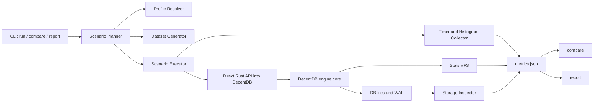

# Rust Benchmark Plan for DecentDB

**Date:** 2026-03-29  
**Status:** Draft plan  
**Audience:** engine maintainers, performance engineers, coding agents

## 1. Purpose

This document proposes a new Rust-native benchmark system for DecentDB.

The benchmark system should satisfy two goals at the same time:

1. **Showcase DecentDB's "bare metal" engine performance** with as little non-engine overhead as possible.
2. **Continuously identify the weakest metrics** so engineers and coding agents can focus optimization work where it matters most.

This plan intentionally does **not** treat benchmarking as "run a few timers and print milliseconds." For DecentDB, benchmarking must become a structured KPI system with:

- direct Rust measurement paths
- deterministic workload generation
- support for tiny and enormous runs
- durable-write and recovery measurements
- disk footprint and storage-efficiency metrics
- machine-readable output
- historical comparison and regression ranking

The benchmark system is not just for charts. It is a decision tool for engine work.

---

## 2. Core Opinion

The primary benchmark tool for DecentDB should be a **custom Rust benchmark runner**, not `Criterion.rs` alone.

`Criterion.rs` is excellent for microbenchmarks and should still be used later for hot-path diagnosis. It is **not** the right top-level harness for DecentDB's full engine KPIs because the top-level system must support:

- durable commit measurements on real filesystems
- checkpoint and recovery workflows
- multi-threaded reader/writer scenarios
- disk footprint and page-layout inspection
- VFS byte-count and fsync instrumentation
- run profiles from "smoke" to "extreme"
- machine-readable JSON suitable for scoring and ranking

Those needs are better served by a dedicated Rust CLI crate that orchestrates end-to-end scenarios directly against the Rust engine.

### Recommendation

- Build a new workspace crate, `crates/decentdb-benchmark`.
- Make it the **authoritative macro benchmark runner**.
- Use direct Rust APIs into DecentDB, not Python and not the C ABI.
- Add a separate, optional microbenchmark layer later with `Criterion.rs`.
- Add a small deterministic CI-oriented regression layer later with `iai-callgrind` if needed.

In short:

- **Custom Rust runner** = authoritative KPI dashboard
- **Criterion.rs** = microscope for hot functions
- **iai-callgrind** = deterministic CI regression detector for selected kernels

---

## 3. Design Goals

The new benchmark system should be designed to meet the following goals.

### 3.1 Required goals

- Measure **engine-core behavior**, not Python, FFI, or subprocess glue.
- Prefer the **most direct Rust path** into DecentDB that still represents the user-visible operation being studied.
- Measure **durable behavior** by default for write scenarios.
- Measure **tail latency**, not only averages.
- Support **small, medium, large, and extreme** runs from one CLI.
- Emit **stable machine-readable output** for dashboards, diffs, and agent ranking.
- Track **disk footprint** as a first-class product KPI.
- Be deterministic enough that trend comparisons are meaningful on the same host class.

### 3.2 Strongly preferred goals

- Attribute storage bytes by category, not just total file size.
- Attribute I/O bytes and fsync counts by scenario.
- Separate warm-cache and cold-start style measurements.
- Separate parse/prepare overhead from execute overhead.
- Allow the same scenario to run under multiple scales without code duplication.

### 3.3 Non-goals

- Replacing every existing benchmark immediately
- Cross-engine comparison in the first phase
- Perfectly eliminating all environmental noise on all machines
- Turning the benchmark harness into a broad observability platform

The first version should optimize for **clarity, directness, and usefulness**.

---

## 4. Benchmarking Principles

### 4.1 Product metrics first

Metrics should be chosen based on what users feel and what the PRD promises:

- durable writes
- fast reads
- predictable maintenance and recovery
- compact on-disk storage

Subsystem microbenchmarks are useful only after the product KPIs point to a bottleneck.

### 4.2 Direct path measurement

For repeated operations, the benchmark should not accidentally measure:

- SQL parsing
- repeated query planning
- string building
- benchmark-side allocations

Unless that is the explicit target of the scenario.

For example:

- repeated point reads should use **prepare once, bind many, execute many**
- durable insert loops should use a prebuilt insert plan or direct engine API
- parser/plan overhead should be a separate optional benchmark family

### 4.3 Durable by default

For core write KPIs, the baseline mode must be the real durable path, not a relaxed mode.

Relaxed modes may be measured, but they must never replace or obscure the durable baseline.

### 4.4 Real filesystem for durability and size metrics

Any benchmark concerning:

- commit latency
- checkpoint behavior
- recovery
- WAL growth
- on-disk footprint

must run on a real host filesystem, not a fake in-memory path and not a container overlayfs mount if the goal is storage truth.

### 4.5 Histograms over averages

The system should record p50, p95, p99, and max where latency matters.

Mean latency alone is not enough for embedded databases.

### 4.6 Comparison must be machine-driven

The benchmark system should rank regressions and opportunity gaps automatically. It should not rely on humans manually reading logs.

---

## 5. Proposed Architecture

## 5.1 Top-level decision

Build a new binary crate:

```text
crates/decentdb-benchmark/
```

This crate should be a normal Rust CLI application, not a `cargo bench` harness.

### Why a binary crate instead of relying on `cargo bench`

- better control over CLI and profiles
- easier multi-artifact output
- easier cross-process isolation
- better fit for long-running scenarios
- better fit for storage inspection and comparison commands
- easier to run in CI, nightly jobs, and local tuning loops

`cargo bench` can remain useful for microbench suites, but it should not be the main benchmark operating system.

## 5.2 High-level structure

```text
crates/decentdb-benchmark/
  src/
    main.rs
    cli.rs
    profiles.rs
    manifest.rs
    metrics.rs
    compare.rs
    report.rs
    env_capture.rs
    histogram.rs
    storage_inspector.rs
    vfs_stats.rs
    workloads/
      mod.rs
      oltp_narrow.rs
      mixed_orders.rs
      text_heavy.rs
    scenarios/
      mod.rs
      durable_commit.rs
      batch_write.rs
      point_lookup.rs
      range_scan.rs
      join_read.rs
      aggregate.rs
      read_under_write.rs
      checkpoint.rs
      recovery.rs
      startup.rs
      storage_efficiency.rs
```

## 5.3 Architectural layers



---

## 6. Direct Measurement Strategy

## 6.1 Direct engine path

The benchmark runner should call DecentDB through the Rust crate directly.

It should **not** use:

- Python
- FFI bindings
- CLI subprocesses

for the primary benchmark path.

## 6.2 Direct operation path inside the Rust engine

The benchmark runner should use the most direct path that still corresponds to the metric being measured.

### Required path decisions

- **Repeated execution benchmarks**
  - Use prepare-once, bind-many, execute-many semantics.
  - Do not reparse SQL in the hot loop unless the scenario is explicitly "parse/prepare latency."

- **Bulk ingest benchmarks**
  - Use the most direct supported Rust bulk load path.
  - Do not build giant in-memory SQL strings.

- **Storage and WAL benchmarks**
  - If the stable Rust API cannot expose the necessary direct path cleanly, introduce a benchmark-only internal feature such as:
    - `bench-internals`
    - read-only storage inspection hooks
    - VFS statistics wrappers

This is justified because otherwise the benchmark system will measure incidental overhead instead of the engine.

## 6.3 Cross-process isolation

The runner should support executing each scenario in an isolated child process.

This is important for:

- cold-start and reopen measurements
- crash/recovery flows
- avoiding cross-scenario memory pollution
- resetting thread-local and allocator state

Recommended model:

- parent process orchestrates the suite
- child process runs one scenario/trial and writes one result file
- parent merges the result files into a single run summary

---

## 7. Workload Families

The benchmark system should not rely on one synthetic table shape.

Use a small set of named workload families that capture different storage and access patterns.

## 7.1 Required workloads

### A. `oltp_narrow`

Purpose:

- benchmark classic embedded transactional behavior
- keep rows narrow enough to isolate commit, WAL, and index overhead

Shape:

- integer primary key
- timestamp column
- short status text
- one or two secondary indexes

Use for:

- durable commit
- point lookup
- range scan
- read under write
- startup

### B. `mixed_orders`

Purpose:

- benchmark realistic relational OLTP behavior
- test joins, aggregates, and moderate-width rows

Shape:

- parent and child tables
- indexed foreign key or indexed join key
- text, integer, and numeric payloads
- modest secondary indexing

Use for:

- join latency
- aggregate throughput
- batch ingest
- checkpoint and recovery
- storage efficiency on realistic data

### C. `text_heavy`

Purpose:

- stress variable-width record encoding
- stress text indexes or substring-related paths
- expose overflow and page packing behavior

Shape:

- moderate to large text fields
- controlled length distribution
- optional search index

Use for:

- text lookup/query benchmarks
- storage efficiency
- overflow and fragmentation inspection

## 7.2 Optional later workloads

- `blob_heavy`
- `time_series_append`
- `wide_sparse`
- `hot_secondary_index`

These are valuable later, but not required for the first milestone.

---

## 8. Benchmark Scenario Catalog

The table below defines the benchmark families that should exist in the new system.

### 8.1 Tier 1: absolute key metrics

These are the metrics DecentDB should treat as first-class release KPIs.

| Scenario ID | Why it matters | Primary metrics | Required |
| --- | --- | --- | --- |
| `durable_commit_single` | Measures the most painful embedded write path | txn end-to-end p50/p95/p99/max, commit-only p50/p95/p99/max, fsync count, bytes written per commit | Yes |
| `durable_commit_batch` | Measures whether small-batch writes scale correctly | rows/sec, batch commit p50/p95/p99, bytes written per row, WAL growth | Yes |
| `point_lookup_warm` | Most common embedded read KPI | lookup p50/p95/p99/max | Yes |
| `point_lookup_cold` | Startup and cache-miss sensitivity | first-read latency, batch p50/p95 | Yes |
| `range_scan_warm` | Sequential indexed access matters heavily for local apps | rows/sec, MB/sec, p50/p95 per scan | Yes |
| `read_under_write` | Core concurrency promise: one writer, many readers | reader degradation ratio, writer throughput degradation, reader p95 under load | Yes |
| `checkpoint` | Must be predictable and bounded | total checkpoint ms, writer stall ms, reader stall ms, WAL bytes before/after | Yes |
| `recovery_reopen` | Startup after WAL accumulation is a real user pain | reopen ms, replay ms, first query ms | Yes |
| `storage_efficiency` | Product-level footprint KPI | db bytes, wal bytes, space amplification, bytes/row, page fill | Yes |

### 8.2 Tier 2: important but secondary

| Scenario ID | Why it matters | Primary metrics | Required |
| --- | --- | --- | --- |
| `join_read` | Real relational read path | p50/p95 join latency, rows/sec | Yes |
| `aggregate_group_by` | Common analytical summary path | rows/sec, p50/p95 per aggregate query | Yes |
| `startup_open` | Embedded database open cost matters | open ms, first statement ms | Yes |
| `bulk_load` | Important for import/setup workflows | rows/sec, bytes written, final size | Nice to have early |
| `secondary_index_lookup` | Useful if PK numbers look good but secondary path is weak | p50/p95 lookup latency | Nice to have early |

### 8.3 Tier 3: quality-of-life metrics

| Scenario ID | Why it matters | Primary metrics | Required |
| --- | --- | --- | --- |
| `prepare_parse_plan` | Separates parser/planner work from execute work | prepare ms, plan ms | Later |
| `delete_churn` | Reveals free-space reuse quality | delete throughput, free bytes, fragmentation ratio | Later |
| `maintenance_compaction` | Useful if compaction/vacuum exists | maintenance ms, bytes reclaimed | Later |
| `text_search` | Useful when text indexing matters | p50/p95 lookup latency, index bytes | Later |

---

## 9. Exact Metric Definitions

Every metric should have a stable identifier, a unit, and a direction.

### 9.1 Latency metrics

Latency metrics should be reported in:

- `ns` internally when feasible
- `us` or `ms` in final JSON depending on scale

For end-user readability, prefer:

- `us` for sub-millisecond work
- `ms` for multi-millisecond operations

Each latency metric should report:

- p50
- p95
- p99
- max
- sample count
- mean and stddev

### 9.2 Throughput metrics

Throughput metrics should report:

- rows/sec
- bytes/sec when relevant
- operations/sec

### 9.3 Ratio metrics

Use ratios for the metrics that actually drive optimization choices:

- `reader_p95_degradation_ratio`
- `writer_throughput_degradation_ratio`
- `space_amplification`
- `write_amplification`
- `read_amplification`

### 9.4 Disk and storage metrics

Disk-related metrics are mandatory.

The runner should report at least:

- `db_file_bytes`
- `wal_file_bytes_peak`
- `wal_file_bytes_after_checkpoint`
- `db_plus_wal_bytes_steady`
- `logical_payload_bytes`
- `bytes_per_logical_row`
- `space_amplification`

The storage inspector should later add:

- `table_bytes`
- `index_bytes`
- `overflow_bytes`
- `freelist_bytes`
- `metadata_bytes`
- `avg_page_fill_pct`
- `fragmentation_pct`
- `bytes_per_index_entry`

### 9.5 VFS and I/O metrics

To make durable-write optimization concrete, the benchmark system should include a benchmark-aware VFS wrapper that counts:

- read calls
- write calls
- bytes read
- bytes written
- fsync calls
- file create/remove counts

This lets the runner produce metrics like:

- `bytes_written_per_commit`
- `fsyncs_per_commit`
- `bytes_written_per_row`
- `bytes_read_per_lookup`

This is extremely useful for both human analysis and agent ranking.

---

## 10. Disk Footprint and Storage Efficiency KPI Plan

Disk size is not merely a side observation. It should be benchmarked as a product KPI.

### 10.1 Why this matters

For an embedded database engine, disk footprint affects:

- install size
- sync/export size
- local-first storage costs
- device storage pressure
- checkpoint and recovery time
- cache density

### 10.2 Core storage KPIs

For each storage-efficiency run, compute:

- `logical_payload_bytes`
  - bytes implied by the source dataset values, not the stored file
- `steady_state_file_bytes`
  - database file plus WAL after a checkpoint and clean close
- `space_amplification`
  - `steady_state_file_bytes / logical_payload_bytes`
- `bytes_per_logical_row`
  - `steady_state_file_bytes / row_count`
- `wal_peak_bytes`
  - largest observed WAL during the scenario
- `wal_residual_bytes`
  - WAL bytes after steady-state checkpoint

### 10.3 Required storage-efficiency scenarios

The benchmark system should include at least these storage-efficiency runs:

- **load-and-checkpoint**
  - load dataset
  - checkpoint
  - close
  - measure final footprint

- **delete-churn**
  - load
  - delete a controlled fraction
  - checkpoint
  - measure free space and fragmentation

- **reopen-steady-state**
  - close and reopen after checkpoint
  - verify footprint and WAL residual state

### 10.4 Storage inspector design

The plan should include a DecentDB-native storage inspector, ideally behind a benchmark or debug feature.

It should be able to answer:

- how many bytes are table pages
- how many bytes are index pages
- how many bytes are overflow pages
- how many bytes are freelist or reusable pages
- how much dead or unused space exists inside pages

This is far more useful than a single "database is 4 GB" number.

### 10.5 How these metrics drive optimization

These KPIs should point to likely optimization zones:

| KPI symptom | Likely subsystem focus |
| --- | --- |
| high `space_amplification` | record format, page packing, index layout |
| high `overflow_bytes` | row format, inline thresholds, overflow policy |
| high `freelist_bytes` | free-page reuse and maintenance |
| low `avg_page_fill_pct` | page split policy, compaction, fragmentation |
| high `wal_peak_bytes` | checkpoint policy, WAL frame overhead |
| high `bytes_written_per_commit` | WAL append path, metadata rewrite amplification |

This mapping should later be included in compare reports so agents can connect bad numbers to likely code regions.

---

## 11. Scalability Model

The benchmark system must support both short runs and huge runs from the same tool.

### 11.1 Profiles

The runner should ship with named profiles.

| Profile | Intended use | Rough size | Rough runtime |
| --- | --- | --- | --- |
| `smoke` | local sanity check | 10k-50k rows | under 2 minutes |
| `dev` | local optimization loop | 100k-250k rows | 2-8 minutes |
| `ci` | lightweight automated regression check | 100k-500k rows, reduced scenario set | under 10 minutes |
| `nightly` | authoritative recurring benchmark | 1M+ rows, full scenario set | 15-60 minutes |
| `showcase` | publishable metrics for docs/README | 1M-10M rows depending on scenario | 30-90 minutes |
| `extreme` | manual large-host runs | 10M-100M+ rows | host-dependent |

### 11.2 Parameter overrides

Profiles must be presets, not hard-coded limits.

The CLI should allow:

- `--rows`
- `--point-reads`
- `--range-scan-rows`
- `--batch-size`
- `--checkpoint-bytes`
- `--reader-threads`
- `--writer-ops`
- `--text-bytes`
- `--seed`
- `--trials`

So a large 15M-row or 50M-row run is simply a profile plus overrides.

### 11.3 Streaming generation

For huge runs, the benchmark runner must avoid giant benchmark-side allocations.

Requirements:

- dataset generation should be iterator-driven
- bulk ingest should operate in chunks
- result collection should use histograms, not store every sample forever
- raw sample retention should be optional and sampled

### 11.4 Separate scenario sizing

Not every scenario needs the same scale.

Examples:

- storage efficiency may need 15M rows
- durable single-row commit may need 5k or 10k measured commits
- point lookups may need 100k or 1M sampled lookups
- checkpoint may need a WAL target size rather than row-count target

The scenario owns its scale model. The profile supplies the preset values.

---

## 12. Measurement Methodology

## 12.1 Timing

Use `std::time::Instant` for wall-clock timing.

Store raw durations in nanoseconds when feasible and aggregate into histograms.

Recommended crates:

- `hdrhistogram` for latency histograms
- `serde` / `serde_json` for output
- `clap` for CLI

No heavy measurement framework is required for the macro runner.

## 12.2 Warmup and trials

Each scenario should define:

- setup phase
- warmup phase
- measured phase
- teardown phase

The setup phase must not pollute the measured phase.

The measured phase should run multiple trials where appropriate. The final report should include both:

- per-trial values
- rolled-up summary values

## 12.3 Warm cache vs cold cache

Where relevant, the runner should label each measurement explicitly as:

- `warm_cache`
- `cold_process`
- `cold_os_cache`

`cold_os_cache` may require elevated privileges or host configuration and should be optional.

`cold_process` is the portable default for reopen/startup style measurements.

## 12.4 Concurrency measurement

For `read_under_write`:

- use one writer thread
- use N reader threads
- keep the workload deterministic
- record reader latencies independently from writer latencies

At minimum, report:

- reader p95 in isolation
- reader p95 under writer load
- degradation ratio
- writer throughput in isolation
- writer throughput under readers
- degradation ratio

## 12.5 Environment capture

Each run should capture an environment manifest:

- git SHA
- git branch
- benchmark crate version
- rustc version
- OS and kernel
- CPU model
- logical and physical core count
- memory size
- filesystem type for the database path
- mount path
- benchmark profile
- scenario set
- seed
- host name or anonymized host fingerprint

Comparisons should only be considered authoritative when the environment class matches.

## 12.6 Benchmark host discipline

The plan should recommend a "strict mode" for authoritative runs:

- run on a quiet host
- pin to a specific CPU set if possible
- prefer fixed power mode
- avoid Docker overlayfs for disk-sensitive runs
- use a dedicated benchmark storage directory

This does not need to block casual local runs, but it should be the standard for published metrics.

---

## 13. Benchmark Output Format

The benchmark system should emit structured artifacts under:

```text
build/bench/
  runs/
    2026-03-29T12-34-56Z-main-<sha>/
      manifest.json
      summary.json
      scenarios/
        durable_commit_single.json
        point_lookup_warm.json
        storage_efficiency.json
      histograms/
        durable_commit_single.hgrm
      storage/
        storage_efficiency.json
  baselines/
    linux-x86_64-nightly-main.json
```

## 13.1 Manifest

The manifest should record:

- run metadata
- environment fingerprint
- profile
- scenario set
- parameter values
- direct engine configuration

## 13.2 Scenario result schema

Every scenario result should contain:

- `scenario_id`
- `profile`
- `workload`
- `scale`
- `durability_mode`
- `cache_mode`
- `trial_count`
- `metrics`
- `histograms`
- `vfs_stats`
- `notes`

### Example sketch

```json
{
  "scenario_id": "durable_commit_single",
  "profile": "nightly",
  "workload": "oltp_narrow",
  "durability_mode": "full",
  "cache_mode": "warm_cache",
  "metrics": {
    "commit_p50_us": 812.4,
    "commit_p95_us": 1091.8,
    "commit_p99_us": 1410.2,
    "txn_p95_us": 1170.0,
    "bytes_written_per_commit": 9216,
    "fsyncs_per_commit": 1.0
  },
  "vfs_stats": {
    "bytes_written": 92160000,
    "fsync_calls": 10000
  }
}
```

## 13.3 Summary file

The run-level `summary.json` should flatten and rank the most important metrics so that humans and agents do not need to scan every scenario file.

It should include:

- top regressions vs baseline
- top improvements vs baseline
- top gaps vs target
- worst current metrics by weighted score

---

## 14. Comparing Benchmarks Over Time

This is one of the most important parts of the plan.

The benchmark system should ship with a `compare` command that understands metric direction and noise thresholds.

## 14.1 Comparison rules

Every metric definition should include:

- metric id
- unit
- direction
  - `smaller_is_better`
  - `larger_is_better`
- noise band
- weight
- optional target

## 14.2 Recommended comparison formula

For each metric:

1. Compute delta vs baseline.
2. Ignore changes within the metric noise band.
3. Compute gap vs target if a target exists.
4. Produce a priority score.

One reasonable scoring model:

```text
effective_regression =
  max(0, normalized_delta_vs_baseline - noise_band)

effective_gap_to_target =
  max(0, normalized_gap_to_target)

priority_score =
  weight * max(effective_regression, effective_gap_to_target)
```

This is not the only valid formula, but the important thing is that the comparison tool must produce:

- a stable numeric ranking
- a small list of top priorities
- a machine-readable output that agents can consume

## 14.3 Baselines

The system should support named baselines such as:

- `main-nightly-linux-x86_64`
- `main-showcase-linux-x86_64`
- `local-last-good`

The benchmark runner should not compare arbitrary runs from different host classes and pretend the results are meaningful.

## 14.4 Agent-oriented output

The compare output should include an "optimization opportunities" section with:

- metric name
- current value
- baseline value
- target value
- delta percentage
- priority score
- likely subsystem owners

Example:

```json
{
  "metric_id": "commit_p95_us",
  "current": 1091.8,
  "baseline": 952.1,
  "target": 700.0,
  "direction": "smaller_is_better",
  "delta_pct": 14.7,
  "priority_score": 2.4,
  "likely_subsystems": ["wal", "pager", "vfs"]
}
```

That is the exact kind of output a coding agent can use to choose the next task.

---

## 15. Disk Footprint Comparison Protocol

If DecentDB is going to claim footprint wins, the benchmark system must make those claims defensible.

## 15.1 Rules for storage comparisons

For any stored-size comparison between runs or engines:

- use the same schema
- use the same indexes
- use the same dataset
- use the same commit boundaries
- measure after a defined checkpoint/steady-state condition
- record WAL bytes separately

## 15.2 Recommended storage checkpoints

For each storage scenario, capture these measurement points:

- after load, before checkpoint
- after checkpoint
- after close
- after reopen
- after delete churn
- after maintenance operation if available

This avoids misleading "it was smaller at one random moment" claims.

## 15.3 What should be published

For each workload family, publish:

- logical payload bytes
- steady-state on-disk bytes
- space amplification
- WAL peak bytes
- WAL residual bytes
- bytes per row
- page fill
- overflow bytes

Those numbers tell a much more useful story than a single "database size" value.

---

## 16. CLI Plan

The benchmark crate should support at least the following subcommands.

## 16.1 `run`

Runs one or more scenarios.

Examples:

```bash
cargo run -p decentdb-benchmark --release -- \
  run --profile smoke --scenario durable_commit_single

cargo run -p decentdb-benchmark --release -- \
  run --profile nightly --all --output build/bench/runs/nightly.json

cargo run -p decentdb-benchmark --release -- \
  run --profile custom --rows 15000000 --scenario storage_efficiency
```

## 16.2 `compare`

Compares two run artifacts or a run artifact against a named baseline.

Example:

```bash
cargo run -p decentdb-benchmark --release -- \
  compare --baseline build/bench/baselines/main-nightly-linux.json \
          --candidate build/bench/runs/2026-03-29T12-34-56Z-main-abc123/summary.json
```

## 16.3 `report`

`report` should be a **presentation layer**, not another benchmark engine.

It should render already-produced artifacts into forms that are easy to consume in:

- terminals
- CI logs
- docs pages
- release notes
- manual performance reviews

It must **not** recalculate benchmark logic independently of `run` or `compare`.

The authoritative machine-readable data remains:

- `manifest.json`
- `summary.json`
- scenario JSON files
- compare output JSON

`report` exists to make those artifacts fast to understand.

### 16.3.1 Audience model

There are two real audiences.

#### A. Human audience

Usually the maintainer or performance owner wants:

- a quick sense of whether DecentDB is getting better or worse
- a compact summary of the most impressive current numbers
- a clear view of regressions
- enough context to trust the numbers

For this audience, the report should optimize for:

- scannability
- credibility
- a short "headline KPI" view
- clear progress vs baseline

#### B. Programmatic or agent audience

A coding agent or other tool usually wants:

- the weakest current KPI
- the worst regression vs baseline
- the biggest gap to target
- likely owning subsystems

For this audience, the primary source should still be the structured compare output, not markdown parsing.

That said, `report` may still provide a compact **agent brief** view for:

- CI logs
- quick copy/paste into a task prompt
- local terminal workflows

### 16.3.2 Design decision

The report system should therefore support two presentation modes:

- `human`
- `agent_brief`

But only one authority:

- the JSON artifacts produced by `run` and `compare`

This keeps the system honest. If a number appears in a report, it must already exist in the structured artifacts.

### 16.3.3 Recommended inputs

`report` should accept:

- a single run summary for a snapshot-style report
- a compare artifact for progress/regression reporting
- an optional manifest for richer environment details
- optional scenario files when deeper appendices are desired

Examples:

```bash
cargo run -p decentdb-benchmark --release -- \
  report --input build/bench/runs/<run>/summary.json \
         --format markdown \
         --audience human

cargo run -p decentdb-benchmark --release -- \
  report --compare build/bench/compares/<compare>.json \
         --format text \
         --audience human

cargo run -p decentdb-benchmark --release -- \
  report --compare build/bench/compares/<compare>.json \
         --format text \
         --audience agent_brief
```

### 16.3.4 Markdown report schema

Markdown should be the best format for:

- docs publication
- benchmark history pages
- checked-in artifacts
- PR comments
- release summaries

A good markdown report should contain the following sections in this order.

#### 1. Title and run identity

Include:

- benchmark date/time
- git SHA
- branch
- profile
- host class
- scenario set

#### 2. Executive snapshot

This should be the "read this first" section.

It should show:

- whether the run is a snapshot or a comparison
- whether overall KPI health improved or regressed
- the 3-5 most important top-line metrics
- any disqualifying warning such as host mismatch or noisy environment

#### 3. Key KPI table

This table should show the core DecentDB release KPIs:

- durable commit p95
- point lookup warm p95
- point lookup cold p95
- range scan throughput
- read-under-write degradation
- checkpoint time
- recovery reopen time
- space amplification

If compare data exists, each row should also show:

- baseline value
- delta percentage
- target value if defined
- status

#### 4. Top regressions and improvements

Keep this short and ranked.

Recommended limits:

- top 5 regressions
- top 5 improvements

#### 5. Optimization opportunities

This is the bridge section between human review and coding-agent action.

Each row should include:

- metric id
- current value
- baseline value
- target
- priority score
- likely subsystems

#### 6. Storage footprint section

Because disk footprint is a product KPI, it should have its own section with:

- logical payload bytes
- steady-state DB bytes
- WAL peak bytes
- WAL residual bytes
- bytes per row
- space amplification
- page fill
- overflow bytes if available

#### 7. Environment and trust notes

Include:

- rustc version
- OS/kernel
- CPU model
- filesystem type
- seed
- warnings

This section matters because performance claims without environment context are weak.

#### Example markdown shape

```markdown
# DecentDB Benchmark Report

Run: 2026-03-29T12:34:56Z
Git SHA: abc1234
Profile: nightly
Host Class: linux-x86_64-bench-01
Comparison: baseline `main-nightly-linux-x86_64`

## Executive Snapshot

Overall status: 2 KPI regressions, 5 KPI improvements
Most important regression: `durable_commit_single.commit_p95_us` +14.7%
Most important improvement: `range_scan_warm.rows_per_sec` +11.2%
Trust notes: host matched baseline, filesystem matched, no strict-mode violations

## Key KPIs

| KPI | Current | Baseline | Delta | Target | Status |
| --- | ---: | ---: | ---: | ---: | --- |
| Durable commit p95 | 1091.8 us | 952.1 us | +14.7% | 700.0 us | Regressed |
| Warm point lookup p95 | 41.2 us | 44.8 us | -8.0% | 35.0 us | Improved |
| Range scan throughput | 182400 rows/s | 164000 rows/s | +11.2% | 200000 rows/s | Improved |
| Read-under-write degradation | 1.38x | 1.31x | +5.3% | 1.20x | Regressed |
| Recovery reopen | 88.0 ms | 96.2 ms | -8.5% | 70.0 ms | Improved |
| Space amplification | 1.42x | 1.47x | -3.4% | 1.30x | Improved |

## Top Optimization Opportunities

| Metric | Current | Baseline | Target | Score | Likely Owners |
| --- | ---: | ---: | ---: | ---: | --- |
| commit_p95_us | 1091.8 | 952.1 | 700.0 | 2.4 | wal, pager, vfs |
| reader_p95_degradation_ratio | 1.38 | 1.31 | 1.20 | 1.7 | scheduler, locks, pager |

## Storage Footprint

| Metric | Value |
| --- | ---: |
| Logical payload bytes | 2.81 GB |
| Steady-state DB bytes | 3.99 GB |
| WAL peak bytes | 412 MB |
| WAL residual bytes | 8 MB |
| Bytes per row | 286.4 |
| Space amplification | 1.42x |

## Environment Notes

- rustc: 1.xx.x
- kernel: Linux x.y
- filesystem: ext4
- seed: 42
```

### 16.3.5 Plain text report schema

Plain text should be optimized for:

- terminal reading
- CI job logs
- copy/paste into issue comments
- quick local review after a run

Plain text should be shorter than markdown and more aggressively ranked.

Recommended section order:

1. Run header
2. Headline KPI lines
3. Top regressions
4. Top improvements
5. Optimization priorities
6. Storage summary
7. Warnings

The text format should avoid large tables when possible and stay easy to scan in monospaced output.

#### Example text shape

```text
DecentDB Benchmark Report
run=2026-03-29T12:34:56Z sha=abc1234 profile=nightly host=linux-x86_64-bench-01
baseline=main-nightly-linux-x86_64 strict_mode=pass

Headline KPIs
  durable_commit_p95_us ............. 1091.8   baseline 952.1   delta +14.7%   target 700.0
  point_lookup_warm_p95_us .......... 41.2     baseline 44.8    delta -8.0%    target 35.0
  range_scan_rows_per_sec ........... 182400   baseline 164000  delta +11.2%   target 200000
  recovery_reopen_ms ................ 88.0     baseline 96.2    delta -8.5%    target 70.0
  space_amplification ............... 1.42x    baseline 1.47x   delta -3.4%    target 1.30x

Top Regressions
  1. commit_p95_us .................. +14.7%   score 2.4   owners wal,pager,vfs
  2. reader_p95_degradation_ratio ... +5.3%    score 1.7   owners scheduler,locks,pager

Top Improvements
  1. range_scan_rows_per_sec ........ +11.2%
  2. recovery_reopen_ms ............. -8.5%
  3. point_lookup_warm_p95_us ....... -8.0%

Optimization Priorities
  1. commit_p95_us -> focus on wal append path, sync policy, write amplification
  2. reader_p95_degradation_ratio -> focus on contention, reader stalls, page access

Storage Summary
  logical_payload_bytes ............. 2.81 GB
  steady_state_db_bytes ............. 3.99 GB
  wal_peak_bytes .................... 412 MB
  wal_residual_bytes ................ 8 MB
  bytes_per_row ..................... 286.4
  space_amplification ............... 1.42x

Warnings
  none
```

### 16.3.6 Agent brief mode

If `--audience agent_brief` is selected, the report should become much narrower.

The goal is not to impress the reader. The goal is to help an automation system decide what to optimize next.

This mode should include only:

- top 3-10 optimization targets
- metric values
- baseline values
- targets
- priority scores
- likely owners
- trust warnings

Example:

```text
DecentDB Agent Brief
candidate_sha=abc1234 baseline=main-nightly-linux-x86_64 authoritative=true

1. commit_p95_us
   current=1091.8 baseline=952.1 target=700.0 delta_pct=+14.7 score=2.4
   likely_owners=wal,pager,vfs

2. reader_p95_degradation_ratio
   current=1.38 baseline=1.31 target=1.20 delta_pct=+5.3 score=1.7
   likely_owners=scheduler,locks,pager
```

This is useful, but it is still secondary to the structured compare JSON. Agents should prefer JSON whenever possible.

### 16.3.7 Optional HTML later

HTML should be postponed until the benchmark system already has stable JSON, markdown, and text outputs.

The reason is simple:

- HTML is easy to overbuild
- charts can distract from KPI discipline
- the logic should live in `run` and `compare`, not in the renderer

If added later, HTML should provide:

- sortable KPI tables
- collapsible scenario details
- storage breakdown charts
- histogram visualization
- side-by-side baseline comparison

It should render the same underlying report model, not invent a second one.

### 16.3.8 Key rule

`report` should answer:

- "What changed?"
- "What is DecentDB best at right now?"
- "What is DecentDB worst at right now?"
- "What should be optimized next?"
- "Can I trust this run?"

If it cannot answer those quickly, the report format is not doing enough.

## 16.4 `inspect-storage`

Runs the storage inspector on an existing DecentDB file and emits page-level accounting.

This command is especially useful when a footprint KPI regresses.

## 16.5 `baseline`

Allows setting or updating a named baseline artifact explicitly.

---

## 17. Implementation Plan

## Phase 1: foundation

Deliver:

- new crate `crates/decentdb-benchmark`
- CLI with `run`
- profiles
- manifest capture
- scenario framework
- histogram support

Scenarios in this phase:

- `durable_commit_single`
- `point_lookup_warm`
- `range_scan_warm`
- `storage_efficiency`

## Phase 2: core KPI coverage

Deliver:

- `durable_commit_batch`
- `point_lookup_cold`
- `checkpoint`
- `recovery_reopen`
- `read_under_write`
- run-level `summary.json`

This phase is the first point where the benchmark system becomes truly useful for optimization work.

## Phase 3: storage and I/O attribution

Deliver:

- benchmark-aware VFS stats wrapper
- `bytes_written_per_commit`
- `fsyncs_per_commit`
- storage inspector
- page-type accounting
- space amplification breakdown by category

This phase is essential for footprint and write-amplification optimization.

## Phase 4: comparison and ranking

Deliver:

- `compare` command
- baseline management
- weighted priority scoring
- markdown report generation
- agent-friendly JSON ranking output

## Phase 5: microbenchmark layer

Deliver:

- a targeted `Criterion.rs` suite for selected internals
- optional `iai-callgrind` suite for deterministic CI metrics

Candidate microbench targets:

- WAL frame encode/decode
- WAL append path
- page checksum and copy paths
- B+Tree seek
- B+Tree insert and split
- record encode/decode
- trigram tokenization and postings intersection

These do not replace the macro runner. They support it.

---

## 18. CI and Operational Strategy

The benchmark system should be integrated carefully to respect PRD runtime constraints.

## 18.1 PR usage

Do **not** run the full benchmark suite on every PR.

Instead:

- optional manual smoke benchmark on demand
- optional lightweight CI profile on selected perf-sensitive changes

## 18.2 Nightly usage

Nightly or manually triggered runs should execute:

- full KPI suite
- selected large-scale profiles
- comparison against baseline

## 18.3 Showcase usage

The showcase/docs path should use benchmark artifacts produced by the Rust runner, not embed a separate benchmark logic stack in another runtime.

If README/docs visuals are needed, they should be rendered from Rust runner output or from simple post-processing scripts that do **not** own the benchmark logic.

---

## 19. Guardrails

To keep the benchmark system honest:

- durable baselines must remain the default published numbers
- parse/prepare cost must not be silently mixed into execute benchmarks
- benchmark-side allocations must not dominate measured time
- storage claims must record WAL and checkpoint state
- comparisons across non-matching hosts must be flagged as non-authoritative
- benchmark changes must keep old metric ids stable whenever possible

---

## 20. Success Criteria

This plan is successful when DecentDB has a Rust-native benchmark system that can answer all of the following quickly and clearly:

- What is DecentDB's current durable commit p95?
- Which read KPI is weakest right now?
- How much do readers degrade when a writer is active?
- How long does recovery take as WAL size grows?
- How much space does the database consume relative to logical payload?
- Which storage category is consuming the most bytes?
- Which KPI regressed versus the last good baseline?
- Which subsystem is the most likely owner of that regression?

If a coding agent can run the benchmark, read the comparison output, and identify the single highest-value optimization target without human interpretation, then this benchmark system is doing its job.

---

## 21. Final Recommendation

Build the new benchmark system as a **Rust-first KPI platform**, not as a collection of ad hoc `cargo bench` files.

The authoritative system should be:

- a custom Rust CLI crate
- direct to the DecentDB Rust engine
- profile-driven and scalable
- durable-write aware
- storage-efficiency aware
- machine-readable
- baseline-comparable

Then add `Criterion.rs` later for targeted subsystem diagnosis.

That gives DecentDB the right benchmark shape for both:

- **showcasing the engine honestly**
- **driving optimization work surgically**
