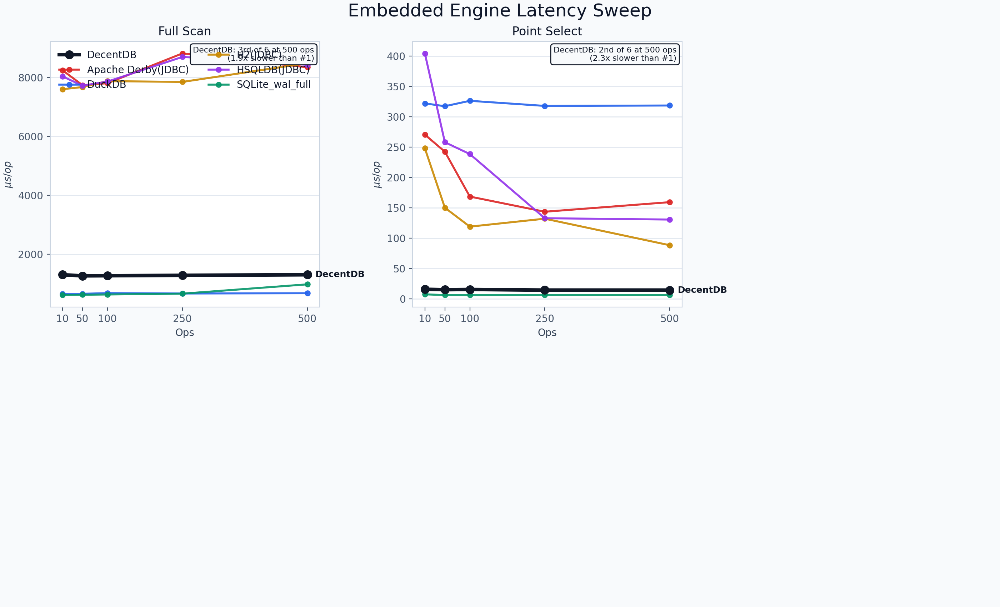
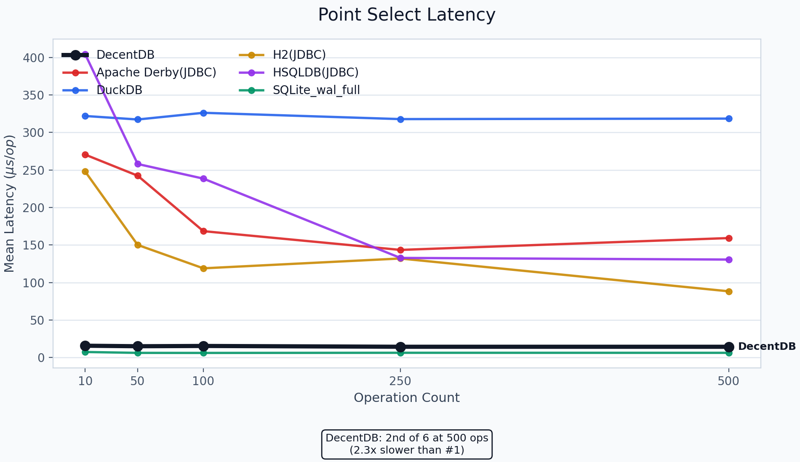
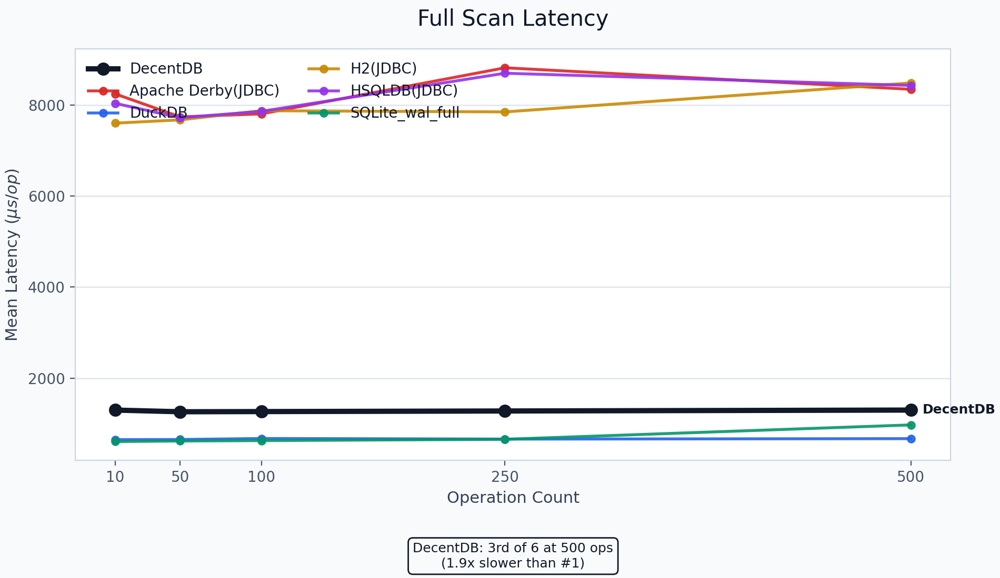
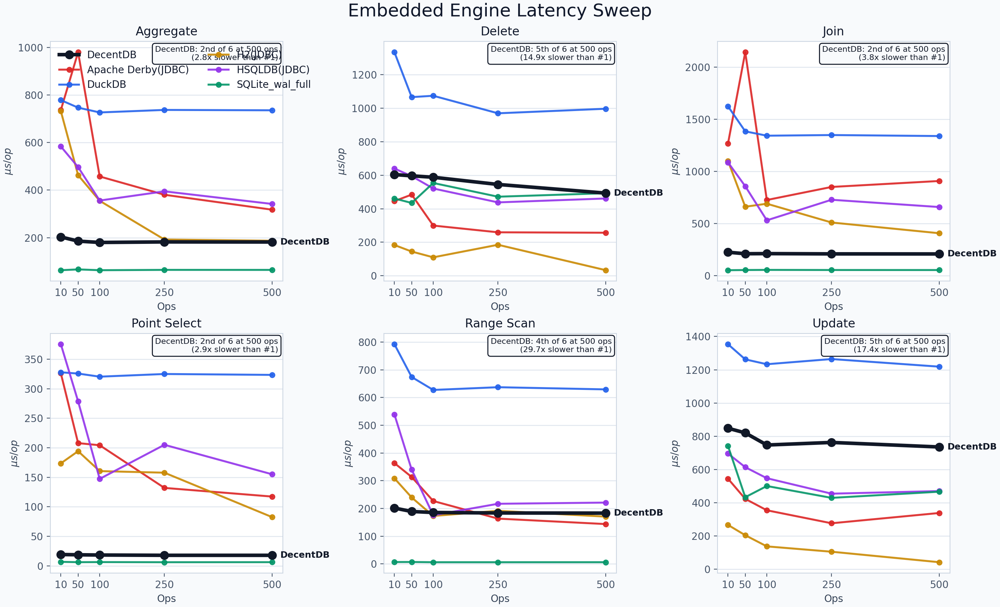
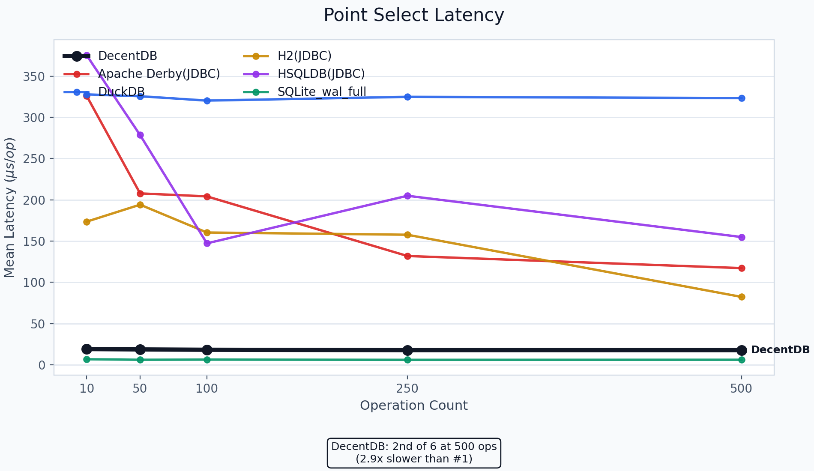
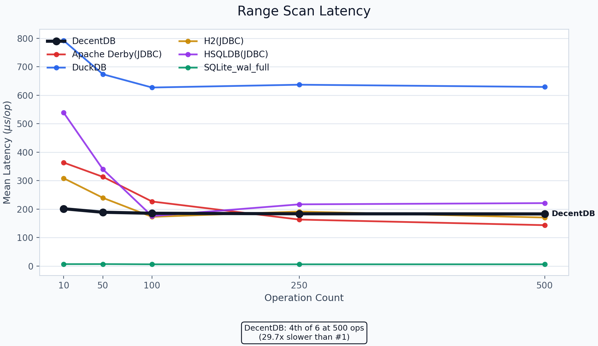
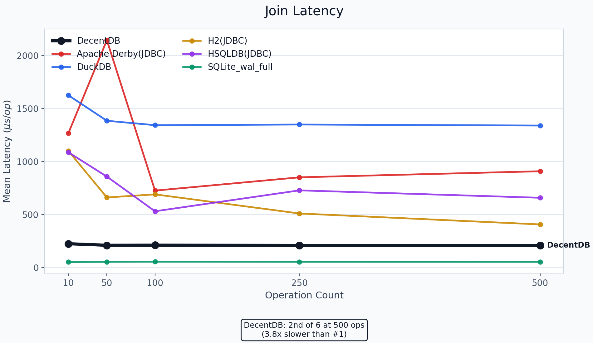
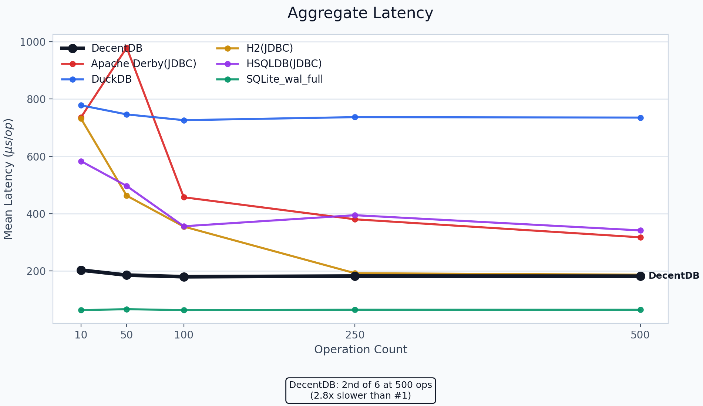
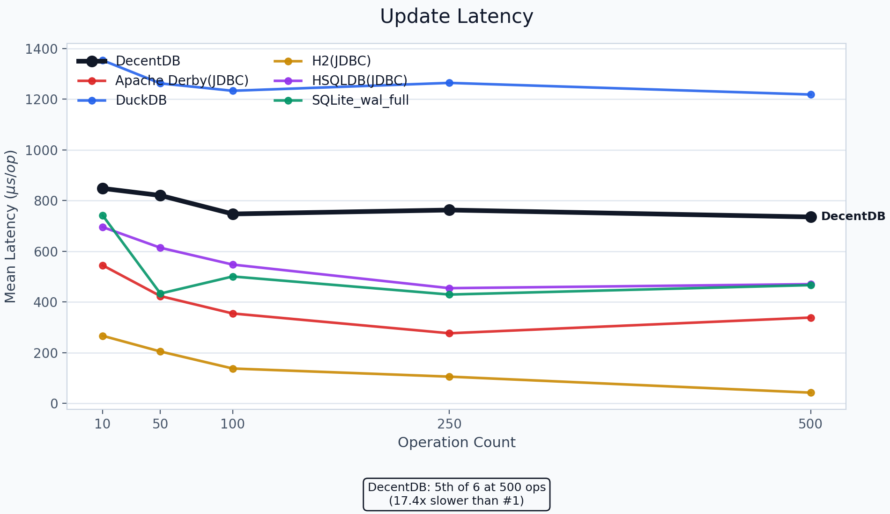
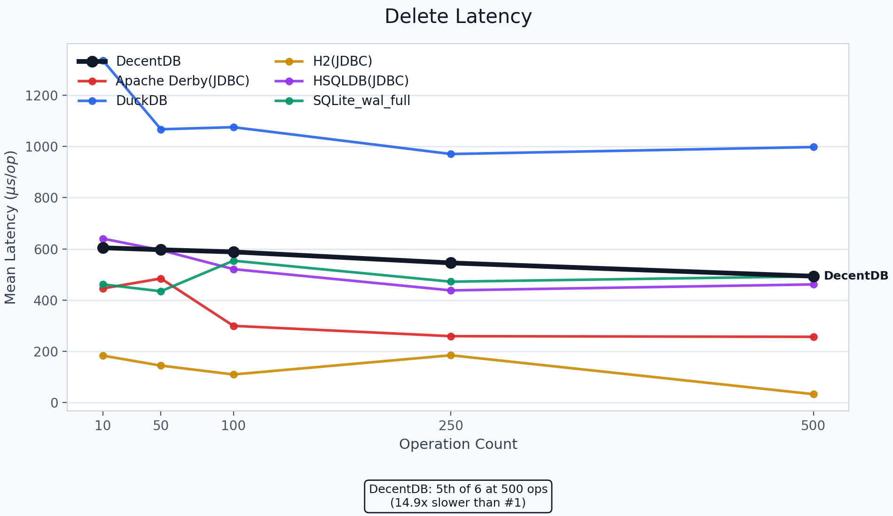

# Benchmarks

This page collects the current Python embedded comparison charts and a plain-language summary of where DecentDB is leading or trailing in the pack.

## Benchmark snapshot metadata

<!-- BENCHMARK_AUTOGEN_METADATA_START -->
- Document updated: 2026-04-01 17:58:15 UTC
- Ranking snapshot: final sweep point at `500` operations from the exported benchmark bundles in `docs/assets/benchmarks/python-embedded-compare/`
<!-- BENCHMARK_AUTOGEN_METADATA_END -->

### Engine version stamps

| Engine | Version stamp | Source |
| --- | --- | --- |
| DecentDB | 2.1.0 | Workspace package version |
| SQLite (`SQLite_wal_full`) | 3.52.0 | Benchmark-reported engine version |
| DuckDB | 1.5.1 | Benchmark-reported engine version |
| H2 (`JDBC`) | 2.2.224 | Benchmark-reported engine version |
| Apache Derby (`JDBC`) | 10.16.1000001.1901046 | Installed `derby.jar` manifest |
| HSQLDB (`JDBC`) | 2.7.4 | Installed `hsqldb.jar` manifest specification version |

## Overview

These benchmark results come from the Python embedded comparison harness in `benchmarks/python_embedded_compare/`.
The goal of that harness is not to produce a single marketing number, but to compare DecentDB against other embedded engines across a small set of repeatable workloads using the same orchestrator, dataset shape, and measurement flow.

What this benchmark is measuring:

- Embedded database behavior under the same Python-driven benchmark runner
- Mean latency across a sweep of operation counts
- Read-heavy and write-heavy query shapes, not just one microbenchmark
- Relative standing of DecentDB versus a mixed pack of native and JVM-backed embedded engines

Database engines included on this page:

- DecentDB
- SQLite (`SQLite_wal_full` configuration)
- DuckDB
- H2 (`JDBC`)
- Apache Derby (`JDBC`)
- HSQLDB (`JDBC`)

Workloads covered here:

- `workload_c`: a flat-table benchmark focused on indexed point lookups and full scans, intended to mirror the simpler Python binding access pattern more closely
- `workload_a`: an OLTP-ish orders-and-customers workload covering point selects, range scans, joins, aggregates, updates, and deletes

How to interpret the results:

- Lower mean latency is better.
- The summary table at the top uses the final sweep point shown in the charts: `500` operations.
- The charts underneath show the full trend across `10`, `50`, `100`, `250`, and `500` operations.
- A strong result on one benchmark does not imply the same result on all benchmarks; this page is meant to show both the strong and weak areas clearly.

The summary table below uses the latest sweep point shown in the charts: `500` operations. Lower mean latency is better.

## At-a-glance summary

<!-- BENCHMARK_AUTOGEN_SUMMARY_START -->
| Workload | Benchmark | Leader at 500 ops | Leader mean latency (us/op) | DecentDB mean latency (us/op) | DecentDB rank | Reading |
| --- | --- | --- | ---: | ---: | --- | --- |
| Workload C | Full scan | DuckDB | 673.50 | 1301.11 | 3rd of 6 | Trailing |
| Workload C | Point select | SQLite_wal_full | 6.34 | 14.40 | 2nd of 6 | Near the front |
| Workload A | Point select | SQLite_wal_full | 6.22 | 17.83 | 2nd of 6 | Near the front |
| Workload A | Aggregate | SQLite_wal_full | 64.68 | 181.91 | 2nd of 6 | Near the front |
| Workload A | Join | SQLite_wal_full | 54.84 | 209.06 | 2nd of 6 | Near the front |
| Workload A | Range scan | SQLite_wal_full | 6.16 | 183.10 | 4th of 6 | Trailing |
| Workload A | Delete | H2(JDBC) | 33.10 | 493.33 | 5th of 6 | Trailing |
| Workload A | Update | H2(JDBC) | 42.18 | 735.49 | 5th of 6 | Trailing |
<!-- BENCHMARK_AUTOGEN_SUMMARY_END -->

Notes:

- `0.00 us/op` means the chart data rounded the measured mean latency down to zero at this display precision. It does not mean the operation was literally free.
- `6th of 6` on a chart means DecentDB was slowest for that specific benchmark at that specific operation count. It is not an overall ranking across all benchmarks.
- These charts come from the exported benchmark bundles in `docs/assets/benchmarks/python-embedded-compare/`.

## How to read these charts

Use this page in two passes:

1. Check the summary table first. It tells you where DecentDB ranks at the `500`-operation sweep point for each benchmark.
2. Then look at the matching chart to see the full curve across `10`, `50`, `100`, `250`, and `500` operations.

Reading rules:

- Lower mean latency is better.
- The dark DecentDB series is emphasized so you can find it quickly.
- The badge on each per-benchmark chart reports DecentDB's rank for that benchmark at the final sweep point.
- A rank like `2nd of 6` means only one engine was faster on that metric at `500` ops.
- A rank like `6th of 6` means DecentDB was slowest on that benchmark at `500` ops, not that it was worst overall.

Example:

<!-- BENCHMARK_AUTOGEN_EXAMPLES_START -->
- In `workload_c / full_scan`, DecentDB is `3rd of 6`, so it leads that benchmark at `500` ops.
- In `workload_a / update`, DecentDB is `5th of 6`, so it trails the pack on that specific write-path measurement.
- In `workload_a / point_select`, DecentDB is `2nd of 6`, which is a competitive result even though it is not the leader.
<!-- BENCHMARK_AUTOGEN_EXAMPLES_END -->

## Workload C: Flat-table binding parity

This workload mirrors the simpler Python binding access pattern more closely than the OLTP-style canonical suite.

### Overview

### Point select

### Full scan

## Workload A: OLTP-ish orders

This workload uses the canonical orders-and-customers schema and is more sensitive to write-path and relational execution behavior than workload C.

### Overview

### Point select

### Range scan

### Join

### Aggregate

### Update

### Delete

