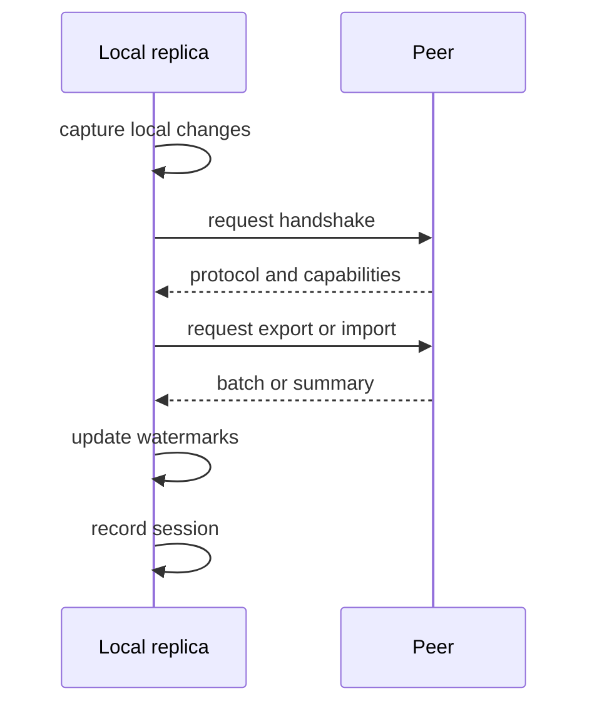

# Concepts

## Glossary

### Replica

A DecentDB database file that participates in sync.

### Peer

An endpoint registered in the peer catalog. A peer usually points at another
replica or at a relay/dev server.

### Scope

A named replication rule that limits which tables and rows are eligible to
move.

### Journal

The durable sidecar file that records sync-relevant row mutations.

The journal file lives next to the database file and uses the `.sync-journal`
suffix.

### Watermark

A progress marker for what has already been exchanged with a peer. Watermarks
are used to avoid replaying records that have already been applied.

### Changeset

A public, versioned sync envelope created from a checkpoint, branch diff, or
snapshot boundary. Changesets are stable application/relay/SDK contracts; the
raw journal remains an internal capture format.

### Relay

A self-hosted process that authenticates clients, attaches tenant and subject
identity, and transports changesets without changing DecentDB's
one-writer/many-readers engine model.

### Shape

A named subscription backed by a sync scope. Shape snapshots and incremental
changesets are resumable by checkpoint and must be acknowledged durably.

### Tombstone

A durable delete marker. Tombstones preserve replication correctness until
retention rules say the record can be pruned safely.

### Conflict

A remote record could not be applied cleanly because local state, schema, or a
constraint prevented the import from completing as-is.

### Session

A recorded sync attempt. Sessions capture direction, peer, batch IDs, counts,
and errors.

## Session Flow

## Replicas, Peers, and Scopes

- A replica is the thing that owns the data.
- A peer is the thing you talk to.
- A scope decides what data is allowed to flow.

In practice:

1. initialize the local replica
2. create one or more peers
3. create a scope
4. bind the peer to the scope
5. run sync against that peer

## Journals and Batches

The journal is the durable local source of truth for sync-relevant changes.
`sync export` turns a sequence range from the journal into a batch file. `sync import`
replays that batch into another database.

The batch shape is deterministic and JSON-serializable so it can be moved by
tools, scripts, or the .NET SDK.

## Watermarks

DecentDB tracks watermarks in two directions:

- inbound watermarks track what was applied from a remote replica
- outbound watermarks track what was exported to a peer

Watermarks are what make repeated sync incremental rather than replaying the
entire journal every time.

## Tombstones and Deletions

Deletes are not forgotten immediately. A delete becomes a sync-relevant record
so the remote side can see that the row disappeared. That marker stays around
until retention rules allow safe pruning.

## Retention

Retention answers two questions:

1. what is safe to prune?
2. what is currently blocking deeper pruning?

Use `sync doctor` and `sync prune --dry-run` before removing old journal data.
