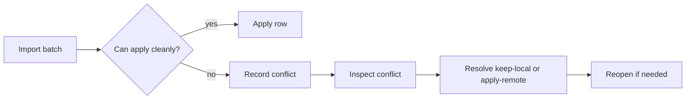

# Conflicts

Conflicts are recorded when a remote change cannot be applied cleanly.

They are visible in:

- `sync conflicts`
- `sync conflict show`
- `sys_sync_conflicts`
- `sync doctor`

## Conflict Types

The current engine emits conflict types such as:

- `insert_insert`
- `update_update`
- `delete_update`
- `missing_target`
- `apply_error`

The exact type depends on the row operation and the local state at import time.

## Default Behavior

The default conflict policy is conservative:

- conflicts are recorded
- unresolved conflicts remain visible
- imports do not silently hide the failure

That is deliberate. The database should stay inspectable, not magical.

## Policy Options

- `record` records the conflict and leaves the local state unchanged.
- `stop` stops on the first conflict and reports it.
- `last-writer-wins` applies the remote value.
- `origin-priority` prefers a configured peer ordering.

Use `sync conflict policy get` and `sync conflict policy set` to inspect or
change the active policy.

## Conflict Workflow



## Manual Inspection

```bash
decentdb sync conflicts --db=app.ddb --format=table
decentdb sync conflict show --db=app.ddb --id=1 --format=json
decentdb sync conflict policy get --db=app.ddb --format=json
```

## Resolve

```bash
decentdb sync conflict resolve \
  --db=app.ddb \
  --id=1 \
  --action=keep-local \
  --by=ops \
  --note="manual override"
```

Use `--action=apply-remote` when the remote row should replace the local row.

## Reopen

If you want the conflict to remain visible after an earlier resolution, reopen
it:

```bash
decentdb sync conflict reopen --db=app.ddb --id=1
```

## Manual Conflict Demo Pattern

1. create the same table on two replicas
2. insert the same primary key with different values
3. export the source batch
4. import it into the target
5. inspect `sync conflicts`
